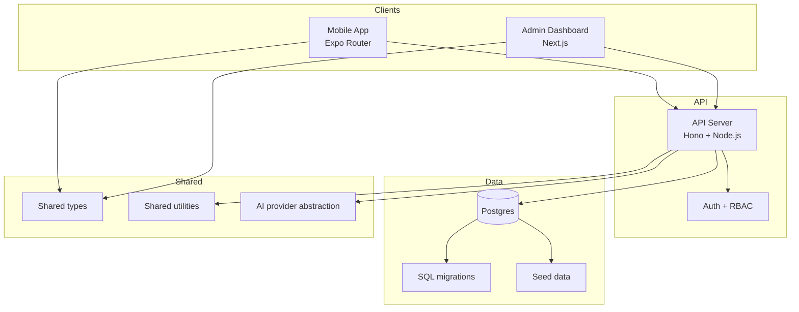
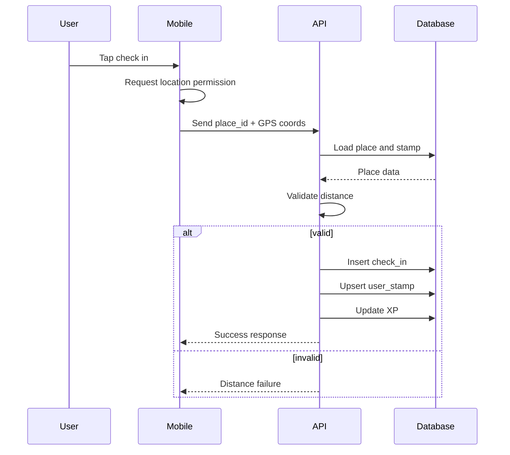
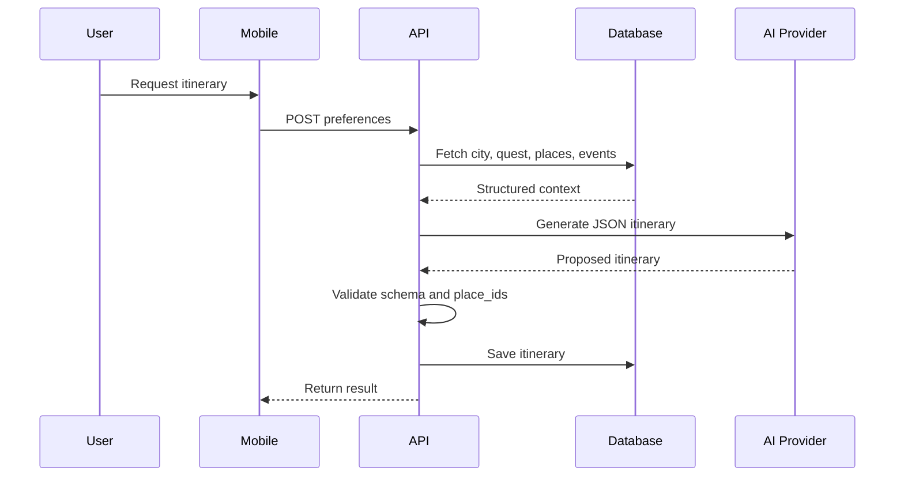

# Questara Architecture

Questara is a monorepo with three primary applications and shared packages:

- `apps/api` - REST API server for public, user, and admin operations
- `apps/admin` - web dashboard for content management
- `apps/mobile` - Expo Router client for discovery, check-ins, and passports
- `packages/*` - shared types, utilities, UI, and AI contracts
- `migrations/` - SQL schema and indexes
- `seed.sql` - demo data

## High-Level System View

## Key Principles

- Server-authoritative rewards: check-ins, XP, and stamps are decided by the API, not the client.
- Database-backed AI: itinerary generation can only use places and events fetched from the database.
- Shared contracts: types and validation live in shared packages so API, admin, and mobile stay aligned.
- Future expansion: schema includes `city_id` and other partitioning fields so new cities can be added without redesign.

## Domain Model

Core entities:

- `cities`
- `places`
- `events`
- `quests`
- `quest_stops`
- `stamps`
- `check_ins`
- `user_stamps`
- `itineraries`
- `submissions`
- `profiles`

## Core Flows

### Check-In

### Itinerary Generation

## Access Control

- Public users can read published quests, verified places, and published events.
- Authenticated users can create submissions, check in, and save itineraries.
- Admin users can manage cities, places, events, quests, stamps, and submissions.
- Sensitive keys remain server-side only.

## Mobile Data Path

Mobile reads from the API and never talks directly to the database.
The client should rely on:

- API responses
- Supabase auth session
- local mock data when backend config is missing

## AI Boundary

AI is a helper layer, not the source of truth.
It may:

- narrate itineraries
- extract structured submission fields
- help admins generate descriptions

It must not:

- invent places, events, prices, or coordinates
- award XP
- validate check-ins
- publish submissions without review

## Shared Package Roles

- `packages/types` - domain and API types
- `packages/utils` - distance, dates, currency, validation helpers
- `packages/ui` - reusable UI primitives
- `packages/ai` - provider interface, prompts, schema, mock provider

## Related Docs

- [Root README](./README.md)
- [Deployment](./DEPLOYMENT.md)
- [PRD docs](./docs/PRD/README.md)
