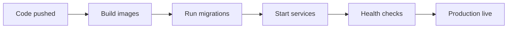

# Questara Deployment

This document covers the production deployment path for the Questara monorepo.

## Deployment Targets

- API: Docker container on port `3001`
- Admin: Docker container on port `3000`
- Database: Postgres on port `5432`
- Mobile: Expo EAS build for app stores or internal distribution

## Production Files

- [docker-compose.prod.yml](./docker-compose.prod.yml)
- [apps/api/Dockerfile](./apps/api/Dockerfile)
- [apps/admin/Dockerfile](./apps/admin/Dockerfile)
- [scripts/migrate.sh](./scripts/migrate.sh)
- [.env.production.example](./.env.production.example)

## Required Environment Variables

Database:

- `DATABASE_URL`
- `POSTGRES_USER`
- `POSTGRES_PASSWORD`
- `POSTGRES_DB`

Supabase:

- `SUPABASE_URL`
- `SUPABASE_ANON_KEY`
- `SUPABASE_SERVICE_ROLE_KEY`

API:

- `AI_PROVIDER`
- `CHECK_IN_RADIUS_METERS`
- `PORT`
- `NODE_ENV`

Admin:

- `NEXT_PUBLIC_API_URL`
- `NEXT_PUBLIC_SUPABASE_URL`
- `NEXT_PUBLIC_SUPABASE_ANON_KEY`

Mobile:

- `EXPO_PUBLIC_API_URL`
- `EXPO_PUBLIC_SUPABASE_URL`
- `EXPO_PUBLIC_SUPABASE_ANON_KEY`

## Production Stack

The production compose file starts:

- `db` - Postgres 16 with persistent volume
- `api` - Hono server built from `apps/api/Dockerfile`
- `admin` - Next.js server built from `apps/admin/Dockerfile`

The API uses the bundled `db` service by default.

## Production Flow



## Recommended Deployment Steps

1. Copy [.env.production.example](./.env.production.example) to your production env manager.
2. Set strong database and service role secrets.
3. Build and start the stack:

```bash
docker compose -f docker-compose.prod.yml up -d --build
```

4. Run migrations:

```bash
./scripts/migrate.sh
```

5. Verify:

- API health at `http://localhost:3001/healthz`
- Admin at `http://localhost:3000`

6. Deploy the mobile app separately with Expo EAS.

## Local vs Production

- Local development uses `docker-compose.yml`.
- Production uses `docker-compose.prod.yml`.
- Local development may rely on mock data and local env values.
- Production should use real secrets and production auth config.

## Operational Notes

- Keep `SUPABASE_SERVICE_ROLE_KEY` out of client bundles.
- Keep AI keys server-side only.
- Run migrations before first production traffic.
- Update the API image whenever shared packages or route code changes.

## Rollback Guidance

If a deploy fails:

1. Stop the affected container.
2. Roll back to the previous image tag.
3. Re-run health checks.
4. Verify the database schema still matches the running code.

## Related Docs

- [Architecture](./ARCHITECTURE.md)
- [Root README](./README.md)
- [Mobile README](./apps/mobile/README.md)
