# PRD v0.2 — Questara

**Product:** Questara / JelajahPass / StampTrip  
**Category:** Gamified local discovery, cultural tourism, event bundling, and AI-assisted trip planning  
**Target market:** Indonesia  
**Initial MVP city:** Pick one: Surabaya, Jakarta, Yogyakarta, Bandung, or Malang  
**Primary niche for MVP:** Museum, heritage, art, culture, walking routes, and curated weekend experiences  
**Document audience:** Founder, product, design, engineering, AI coding agents  
**Agent targets:** Kimchi, Codex, Claude Code, Cursor, Windsurf, Copilot, Devin-like agents  
**Status:** Draft for implementation  
**Version:** 0.2  
**Last updated:** 2026-06-14  

---

## 0. Agent Instructions

This PRD is written to be implementation-ready for AI coding agents.

When implementing, agents must follow these principles:

1. Build an MVP first, not a full travel super-app.
2. Prioritize mobile app + database + admin CMS + check-in + stamp mechanics.
3. Do not build mass social media scraping in MVP.
4. AI itinerary generation must only use places/events from the app database.
5. Use structured data and deterministic validation before calling LLMs.
6. All database tables must support future city expansion.
7. Keep code modular, typed, and easy to replace later.
8. Add mock data mode for local development.
9. Add basic tests for critical logic: distance validation, stamp awarding, quest progress, itinerary JSON validation.
10. Avoid hardcoding only one city except in seed data.

Recommended MVP stack:

- Mobile: Expo React Native + TypeScript
- Admin: Next.js + TypeScript
- Backend/Data: Supabase Auth, Postgres, Storage, Edge Functions
- Maps: Mapbox, Google Maps, or MapLibre/OpenStreetMap
- AI: Provider-agnostic wrapper with mock mode
- Analytics: PostHog or Supabase event table
- Deployment: EAS for mobile, Vercel for admin, Supabase for backend

---

## 1. Executive Summary

Questara turns Indonesian local tourism into playable city quests. Users discover curated bundles of places and events, follow a roadmap, check in at real-world locations, collect digital stamps, complete quests, and generate personalized itineraries.

The product combines:

1. Local place/event discovery
2. Curated route bundles called quests
3. Real-world GPS/QR check-in
4. Digital passport and collectible stamps
5. AI-assisted itinerary planning
6. Admin/community submission workflow for data freshness
7. Optional future partner programs with museums, local governments, communities, venues, cafes, and event organizers

The MVP should focus on one city and one theme cluster: museum, heritage, art, and cultural discovery. The app should prove that users are willing to start a quest, visit locations, collect stamps, and return for more quests.

---

## 2. Product Thesis

Indonesian local events and cultural destinations are fragmented across Instagram, TikTok, news articles, Google Maps, venue pages, ticketing apps, tourism office pages, and word-of-mouth. Users often want to explore, but planning is annoying.

Questara solves this by transforming scattered destinations into curated, gamified routes.

The wedge is not generic AI trip planning. The wedge is:

> Local discovery + quest roadmap + check-in + digital stamp + shareable progress.

AI is a support layer, not the core product. It helps with itinerary generation, event summarization, and structured data extraction, but the app experience should work without AI.

---

## 3. Product Positioning

### 3.1 One-liner

Questara helps people explore Indonesian cities through curated quests, real-world check-ins, collectible digital stamps, and AI-assisted itineraries.

### 3.2 Tagline options

- Collect places. Complete quests. Explore Indonesia differently.
- Turn your city into a playable map.
- A digital passport for local adventures.
- Discover events, follow quests, collect stamps.
- Your weekend, gamified.

### 3.3 Product category

Gamified local discovery and trip planning.

### 3.4 Competitive framing

Questara is not:

- just an event aggregator
- just a map app
- just an AI trip planner
- just a loyalty program
- just a tourism directory

Questara is:

- a playable discovery layer for cities
- a digital passport system
- a route bundling and itinerary engine
- a lightweight CRM/engagement channel for venues and communities

---

## 4. Problem Statement

### 4.1 User problem

Users want interesting things to do but face these issues:

- Event information is scattered.
- Social media posts are hard to convert into a real plan.
- Users do not know which places are near each other.
- Users do not know what order to visit places in.
- Users are unsure about opening hours, prices, and event validity.
- Local tourism can feel passive and not rewarding.
- Existing travel planner apps are often too generic and not locally curated.

### 4.2 Venue/community problem

Museums, galleries, communities, local governments, and cultural venues need:

- more foot traffic
- repeat visits
- younger audience engagement
- measurable campaign participation
- a way to bundle with nearby destinations
- better digital storytelling
- lightweight gamification without building their own app

### 4.3 Founder opportunity

Start with curated cultural quests, then expand into:

- partner-sponsored quests
- event submission network
- official city passports
- route-based ticket bundles
- local tourism campaigns
- AI-powered itinerary personalization

---

## 5. Goals and Non-Goals

### 5.1 MVP goals

1. Users can sign up and choose a city.
2. Users can browse curated quests.
3. Users can view quest details and ordered stops.
4. Users can view locations on a map.
5. Users can check in at places via GPS.
6. Users can earn stamps after valid check-ins.
7. Users can see their digital passport.
8. Users can see quest progress.
9. Admins can manage cities, places, events, quests, quest stops, and stamps.
10. Users can generate simple itineraries using only database-backed places/events.
11. Users or communities can submit event/place suggestions for admin review.
12. The product can be demoed with one launch city and seeded sample data.

### 5.2 MVP non-goals

Do not include in MVP:

- hotel booking
- flight booking
- train booking
- payment gateway
- marketplace payouts
- complex social network
- direct DMs between users
- mass scraping Instagram/TikTok comments
- fully automated event publishing without admin review
- full public transport route optimization
- dynamic pricing
- native AR features
- complex leaderboard economy
- NFT/blockchain stamp ownership

### 5.3 Success hypothesis

Users will be more likely to visit cultural places and events when those experiences are bundled into quests with visible progress, rewards, and shareable stamps.

---

## 6. Target Users and Personas

### 6.1 Persona A — Urban Explorer

**Profile:** 18–35, lives in a big Indonesian city, likes cafes, museums, art, hidden gems, and weekend activities.

**Needs:**

- Easy answer to “weekend ini ke mana?”
- Curated routes instead of raw search results
- A fun reason to visit cultural places
- Shareable achievements
- Low-budget exploration

**Pain points:**

- Too many scattered recommendations
- Events disappear in social feeds
- Plans are hard to coordinate
- Boring directories do not motivate action

### 6.2 Persona B — Domestic Cultural Tourist

**Profile:** Tourist visiting a city for 1–3 days.

**Needs:**

- Fast planning
- Places near each other
- Realistic itinerary
- Budget and duration estimate
- Local cultural context

### 6.3 Persona C — Museum / Venue Admin

**Profile:** Museum/gallery/venue representative.

**Needs:**

- Increase visits
- Promote events
- Run campaigns
- Track engagement
- Participate in city-wide quests

### 6.4 Persona D — Local Community Organizer

**Profile:** Walking tour, art collective, heritage community, student community, culture creator.

**Needs:**

- Promote events
- Submit activities
- Reach interested audiences
- Bundle event with nearby locations

---

## 7. Core Product Concepts

### 7.1 City

A geographic market, e.g. Surabaya, Jakarta, Bandung, Yogyakarta.

### 7.2 Place

A real-world destination: museum, gallery, heritage site, cafe, park, public space.

### 7.3 Event

A time-bound activity at a place or city area.

### 7.4 Quest

A curated bundle/roadmap of places and optionally events.

Example:

- “Surabaya Heritage Starter”
- “Jakarta Museum Weekend”
- “Jogja Art Walk”
- “Bandung Date Quest”

### 7.5 Quest Stop

One ordered stop in a quest. Usually linked to a place.

### 7.6 Check-in

A user action that proves or approximates that the user visited a place.

MVP methods:

- GPS radius validation
- QR validation for partner locations, optional after MVP

### 7.7 Stamp

A collectible digital item awarded for visiting a place or completing a quest.

### 7.8 Passport

The user’s collection of stamps and city progress.

### 7.9 Itinerary

A generated plan that orders places/events into a schedule based on user preferences, budget, start point, and available time.

---

## 8. MVP Scope

### 8.1 Mobile app MVP

Required screens:

1. Login
2. Register
3. City Selector
4. Home
5. Quest List
6. Quest Detail
7. Quest Map
8. Place Detail
9. Check-in
10. Passport
11. Stamp Detail
12. Itinerary Generator
13. Itinerary Result
14. Event/Place Submission
15. Profile

### 8.2 Admin MVP

Required screens:

1. Admin Login
2. Dashboard
3. Cities CRUD
4. Places CRUD
5. Events CRUD
6. Quests CRUD
7. Quest Builder
8. Stamps CRUD
9. Submissions Review
10. Check-ins Overview
11. Users Overview

### 8.3 Backend MVP

Required backend capabilities:

1. Supabase Auth
2. Database migrations
3. Row Level Security
4. Seed data
5. Storage buckets
6. Edge function: check-in
7. Edge function: generate-itinerary
8. Edge function: parse-submission-link or parse-event-text
9. Shared TypeScript types
10. Basic analytics/event logging

---

## 9. User Experience Overview

### 9.1 Core mobile flow

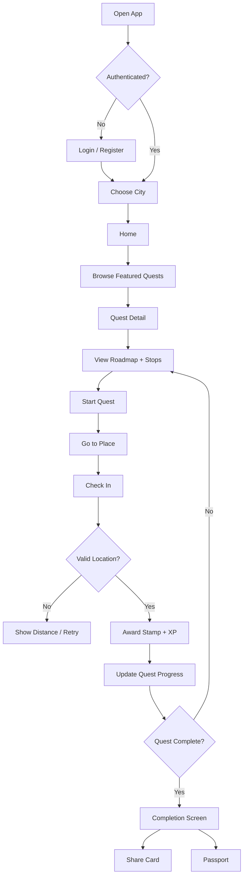

### 9.2 User journey map

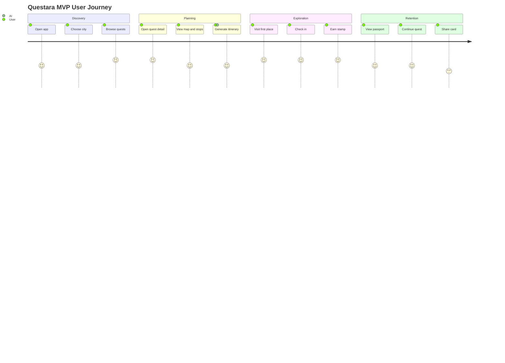

### 9.3 Admin flow

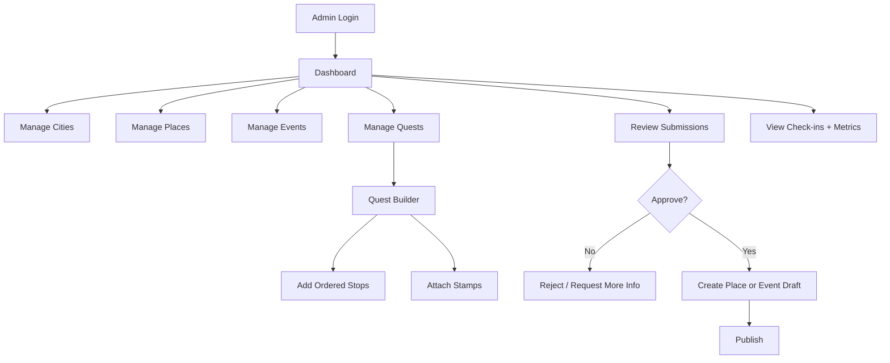

### 9.4 Community submission flow

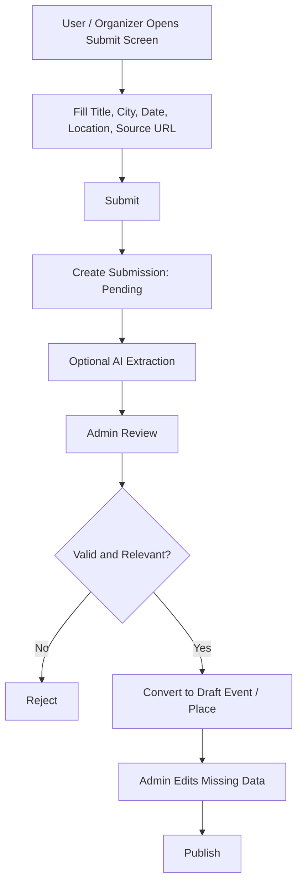

---

## 10. Information Architecture

### 10.1 Mobile navigation

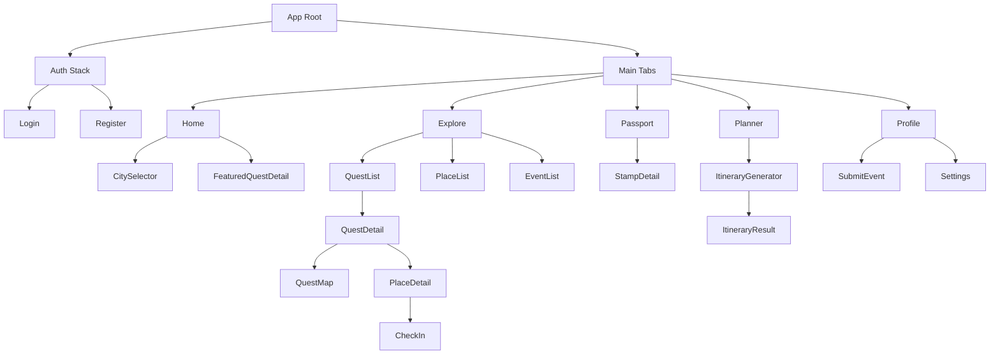

### 10.2 Admin navigation

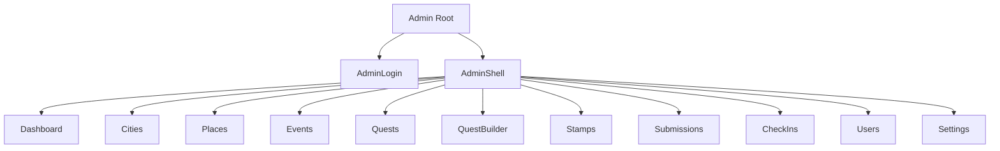

---

## 11. Functional Requirements

### 11.1 Authentication

Users must be able to:

- register with email/password
- log in
- log out
- view their profile
- store display name, avatar URL, home city, and XP

Admin users must be identified by a role in the `profiles` table or a dedicated `admin_users` table.

Acceptance criteria:

- Unauthenticated users are redirected to login.
- Authenticated users can access main app.
- Admin-only routes are inaccessible to normal users.
- New users automatically get a profile row.

### 11.2 City selection

Users must be able to:

- view available cities
- pick active city
- see city-specific quests and places

Acceptance criteria:

- Home content filters by selected city.
- City selection persists locally and/or in user profile.
- App handles no selected city gracefully.

### 11.3 Quest browsing

Users must be able to:

- view list of published quests
- filter by city and category/tag
- see duration, budget, difficulty, number of stops, reward preview
- open quest detail

Acceptance criteria:

- Draft/unpublished quests do not appear in mobile app.
- Quest cards show key metadata.
- Empty state appears when no quests exist.

### 11.4 Quest detail

Users must be able to:

- see quest title, description, cover image
- see ordered stops
- see estimated duration and budget
- see map preview
- see reward/stamp preview
- start or continue quest
- open stop/place detail

Acceptance criteria:

- Completed stops are visually marked.
- Current progress is shown as `completed / total`.
- User can continue from last incomplete stop.

### 11.5 Place detail

Users must be able to:

- view place name, description, category, image
- view address and map location
- view opening hours if available
- view ticket price range if available
- view source URL if available
- check in if the place is part of an active quest or available as standalone

Acceptance criteria:

- Missing opening hours or prices display “Needs confirmation”.
- External source links open safely.
- Coordinates are required for check-in eligible places.

### 11.6 GPS check-in

Users must be able to:

- request location permission
- attempt check-in at a place
- receive success/failure feedback
- earn stamp and XP for valid check-in

Validation logic:

- Get user location from device.
- Fetch place coordinates.
- Calculate distance using Haversine formula.
- If distance <= configured radius, mark valid.
- If invalid, show current distance and allowed radius.

Default radius:

- MVP: 200 meters
- Configurable per place later

Acceptance criteria:

- Invalid GPS check-ins do not award stamps.
- Duplicate stamps for same user, stamp, and quest are prevented.
- Duplicate check-ins can be logged but do not duplicate rewards.
- Check-in function is server-side authoritative.

### 11.7 QR check-in, post-MVP optional

Partner venues may display QR codes. QR tokens should be signed or short-lived.

Post-MVP acceptance criteria:

- Admin can generate QR for a place.
- User can scan QR.
- Backend validates token.
- QR check-in can optionally bypass GPS or require both QR + GPS.

### 11.8 Stamp and passport

Users must be able to:

- see collected stamps
- see locked stamps
- open stamp detail
- see earned date
- see associated place/quest
- see city progress

Acceptance criteria:

- Passport shows stamps grouped by city and/or quest.
- Stamp detail is accessible from reward modal and passport.
- Locked stamps reveal teaser but not full reward if desired.

### 11.9 XP and badges

MVP XP rules:

- Valid check-in: +50 XP
- Complete quest: +200 XP
- First stamp: +100 XP bonus
- Approved submission: +100 XP, optional
- Share card: +20 XP, optional and abuse-limited

Badges can be implemented as static derived achievements post-MVP.

Acceptance criteria:

- XP updates after valid check-in.
- XP cannot be incremented directly from client.
- Quest completion bonus is awarded once.

### 11.10 AI itinerary generation

Users must be able to:

- choose city
- optionally choose quest
- provide starting location text
- provide available hours
- provide budget
- choose preferences/tags
- generate itinerary
- save itinerary
- view result as timeline

Hard rule:

> The AI must only use places/events passed from the database. It must not invent locations, prices, opening hours, or events.

Acceptance criteria:

- Generated itinerary is valid JSON.
- Missing data is marked in `warnings`.
- The UI handles AI failure with fallback route ordering.
- Generated itinerary is saved to `itineraries`.
- Mock provider works without API key.

### 11.11 Event/place submission

Users or organizers must be able to submit:

- title
- city
- location text
- date text
- source URL
- notes

Admin must be able to:

- review submission
- approve
- reject
- convert to event/place draft
- edit structured fields
- publish

Acceptance criteria:

- Submissions do not publish directly.
- Admin can see extracted fields if AI parser is enabled.
- Submission history is preserved.

### 11.12 Admin dashboard

Admin dashboard must show:

- total users
- total quests
- total places
- total published events
- total check-ins
- total stamps earned
- recent submissions
- recent check-ins

Acceptance criteria:

- Admin pages require admin role.
- CRUD operations validate required fields.
- Admin can publish/unpublish quests and events.

---

## 12. Non-Functional Requirements

### 12.1 Performance

- Quest list should load within 2 seconds on normal mobile connection.
- Home screen should show cached/skeleton UI during loading.
- Images should be optimized and stored via Supabase Storage or external CDN.
- Use pagination for lists.

### 12.2 Reliability

- Check-in must be idempotent for rewards.
- Itinerary generation must fail gracefully.
- App must support mock data mode for demos.

### 12.3 Security

- All user-owned data protected by RLS.
- Admin actions require admin role.
- Sensitive keys must never be shipped to mobile client.
- AI API key must be used only server-side.
- GPS check-in reward logic must run server-side.

### 12.4 Privacy

- Do not continuously track user location.
- Request location only during check-in or map features.
- Store check-in coordinates only when user performs check-in.
- Make privacy policy clear before public launch.

### 12.5 Scalability

- City-based partitioning is not required for MVP but schema must include `city_id`.
- Add indexes for common filters.
- Keep ingestion and approval pipeline separated from published data.

---

## 13. Infrastructure Architecture

### 13.1 High-level architecture

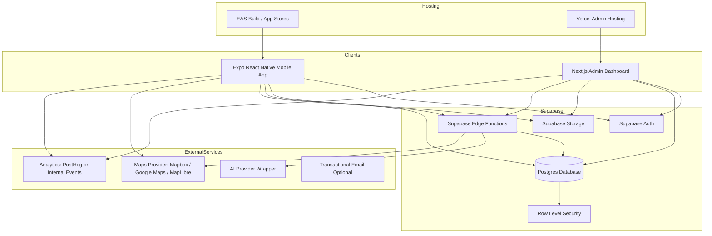

### 13.2 Request lifecycle

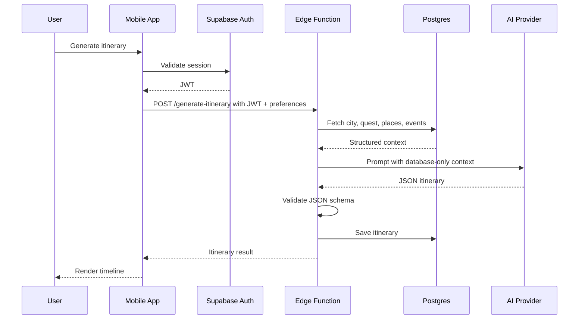

### 13.3 Check-in lifecycle

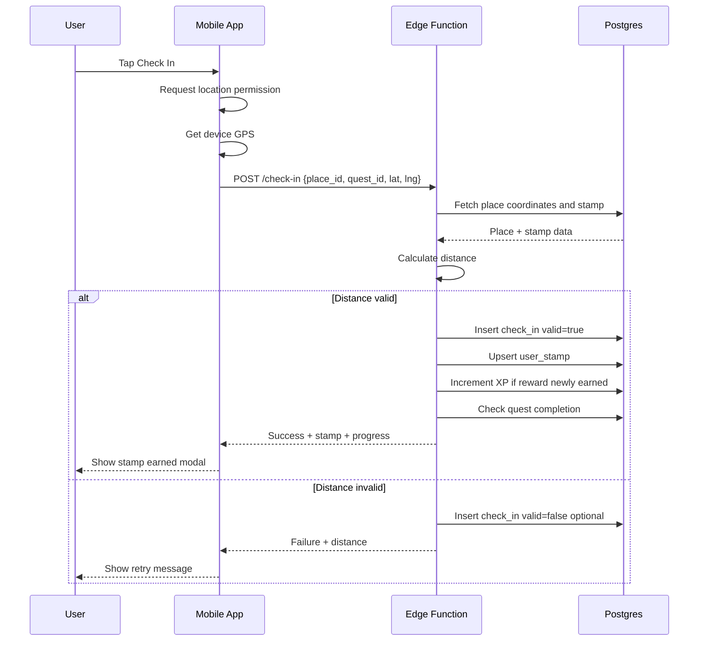

### 13.4 Deployment architecture

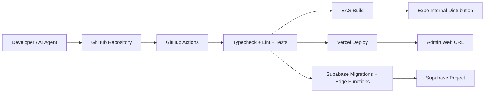

### 13.5 Recommended environments

```txt
local     Local development using mock data and local Supabase if desired
staging   Shared test environment with seeded data
prod      Production environment
```

### 13.6 Infrastructure components

| Component | Recommendation | Notes |
|---|---|---|
| Mobile app | Expo React Native | Fast iteration, iOS/Android |
| Admin app | Next.js | Easy deploy to Vercel |
| Auth | Supabase Auth | Email/password initially |
| Database | Supabase Postgres | Structured places, quests, stamps |
| Storage | Supabase Storage | Place images, stamp images, avatars |
| Backend functions | Supabase Edge Functions | Check-in, AI itinerary, parser |
| Maps | Mapbox or Google Maps | Use provider abstraction |
| AI | Provider-agnostic wrapper | Keep mock provider |
| Analytics | PostHog or internal table | Track funnel events |
| CI/CD | GitHub Actions | Typecheck, lint, tests |
| Admin hosting | Vercel | Simple Next.js hosting |
| Mobile build | EAS | Expo app builds |

---

## 14. Repository Structure

```txt
questara/
  apps/
    mobile/
      app/
      components/
      features/
      lib/
      assets/
      package.json
    admin/
      app/
      components/
      features/
      lib/
      package.json
  packages/
    types/
      src/
        database.ts
        domain.ts
        api.ts
    utils/
      src/
        distance.ts
        dates.ts
        currency.ts
        validation.ts
    ui/
      src/
        Button.tsx
        Card.tsx
        Badge.tsx
    ai/
      src/
        prompts.ts
        schema.ts
        provider.ts
        mockProvider.ts
  supabase/
    migrations/
    seed.sql
    functions/
      check-in/
        index.ts
      generate-itinerary/
        index.ts
      parse-submission/
        index.ts
  docs/
    PRD.md
    ARCHITECTURE.md
    API.md
    DATA_MODEL.md
    KIMCHI_PROMPTS.md
  .github/
    workflows/
      ci.yml
  package.json
  pnpm-workspace.yaml
  turbo.json
  README.md
  .env.example
```

---

## 15. Database Model

### 15.1 Entity relationship diagram

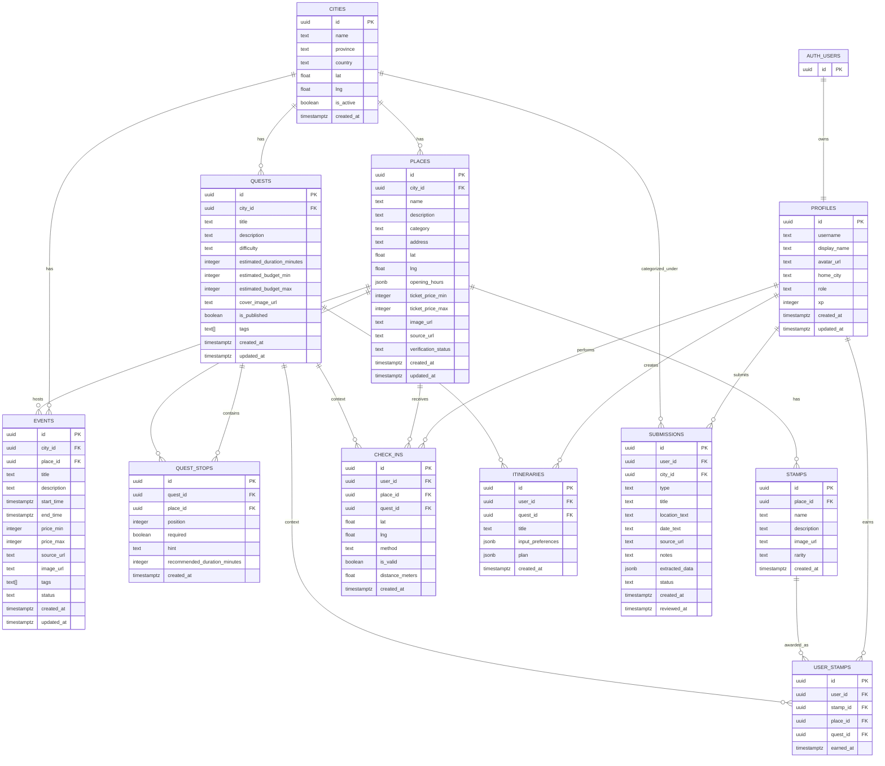

### 15.2 SQL schema draft

```sql
create extension if not exists "pgcrypto";

create table public.profiles (
  id uuid primary key references auth.users(id) on delete cascade,
  username text unique,
  display_name text,
  avatar_url text,
  home_city text,
  role text not null default 'user' check (role in ('user', 'admin')),
  xp integer not null default 0,
  created_at timestamptz not null default now(),
  updated_at timestamptz not null default now()
);

create table public.cities (
  id uuid primary key default gen_random_uuid(),
  name text not null,
  province text,
  country text not null default 'Indonesia',
  lat double precision,
  lng double precision,
  is_active boolean not null default true,
  created_at timestamptz not null default now()
);

create table public.places (
  id uuid primary key default gen_random_uuid(),
  city_id uuid not null references public.cities(id) on delete cascade,
  name text not null,
  description text,
  category text not null,
  address text,
  lat double precision not null,
  lng double precision not null,
  opening_hours jsonb,
  ticket_price_min integer,
  ticket_price_max integer,
  image_url text,
  source_url text,
  verification_status text not null default 'draft' check (verification_status in ('draft', 'verified', 'rejected')),
  created_at timestamptz not null default now(),
  updated_at timestamptz not null default now()
);

create table public.events (
  id uuid primary key default gen_random_uuid(),
  city_id uuid not null references public.cities(id) on delete cascade,
  place_id uuid references public.places(id) on delete set null,
  title text not null,
  description text,
  start_time timestamptz,
  end_time timestamptz,
  price_min integer,
  price_max integer,
  source_url text,
  image_url text,
  tags text[] not null default '{}',
  status text not null default 'draft' check (status in ('draft', 'published', 'expired', 'rejected')),
  created_at timestamptz not null default now(),
  updated_at timestamptz not null default now()
);

create table public.quests (
  id uuid primary key default gen_random_uuid(),
  city_id uuid not null references public.cities(id) on delete cascade,
  title text not null,
  description text,
  difficulty text not null default 'easy' check (difficulty in ('easy', 'medium', 'hard')),
  estimated_duration_minutes integer,
  estimated_budget_min integer,
  estimated_budget_max integer,
  cover_image_url text,
  is_published boolean not null default false,
  tags text[] not null default '{}',
  created_at timestamptz not null default now(),
  updated_at timestamptz not null default now()
);

create table public.quest_stops (
  id uuid primary key default gen_random_uuid(),
  quest_id uuid not null references public.quests(id) on delete cascade,
  place_id uuid not null references public.places(id) on delete cascade,
  position integer not null,
  required boolean not null default true,
  hint text,
  recommended_duration_minutes integer,
  created_at timestamptz not null default now(),
  unique (quest_id, position),
  unique (quest_id, place_id)
);

create table public.stamps (
  id uuid primary key default gen_random_uuid(),
  place_id uuid not null references public.places(id) on delete cascade,
  name text not null,
  description text,
  image_url text,
  rarity text not null default 'common' check (rarity in ('common', 'rare', 'epic', 'legendary')),
  created_at timestamptz not null default now()
);

create table public.check_ins (
  id uuid primary key default gen_random_uuid(),
  user_id uuid not null references public.profiles(id) on delete cascade,
  place_id uuid not null references public.places(id) on delete cascade,
  quest_id uuid references public.quests(id) on delete set null,
  lat double precision,
  lng double precision,
  method text not null default 'gps' check (method in ('gps', 'qr', 'manual_admin')),
  is_valid boolean not null default false,
  distance_meters double precision,
  created_at timestamptz not null default now()
);

create table public.user_stamps (
  id uuid primary key default gen_random_uuid(),
  user_id uuid not null references public.profiles(id) on delete cascade,
  stamp_id uuid not null references public.stamps(id) on delete cascade,
  place_id uuid not null references public.places(id) on delete cascade,
  quest_id uuid references public.quests(id) on delete set null,
  earned_at timestamptz not null default now(),
  unique (user_id, stamp_id, quest_id)
);

create table public.itineraries (
  id uuid primary key default gen_random_uuid(),
  user_id uuid not null references public.profiles(id) on delete cascade,
  quest_id uuid references public.quests(id) on delete set null,
  title text,
  input_preferences jsonb not null default '{}',
  plan jsonb not null default '{}',
  created_at timestamptz not null default now()
);

create table public.submissions (
  id uuid primary key default gen_random_uuid(),
  user_id uuid references public.profiles(id) on delete set null,
  city_id uuid references public.cities(id) on delete set null,
  type text not null default 'event' check (type in ('event', 'place')),
  title text not null,
  location_text text,
  date_text text,
  source_url text,
  notes text,
  extracted_data jsonb not null default '{}',
  status text not null default 'pending' check (status in ('pending', 'approved', 'rejected', 'converted')),
  created_at timestamptz not null default now(),
  reviewed_at timestamptz
);
```

### 15.3 Indexes

```sql
create index idx_places_city_id on public.places(city_id);
create index idx_places_category on public.places(category);
create index idx_events_city_id on public.events(city_id);
create index idx_events_status on public.events(status);
create index idx_events_start_time on public.events(start_time);
create index idx_quests_city_id on public.quests(city_id);
create index idx_quests_is_published on public.quests(is_published);
create index idx_quest_stops_quest_id on public.quest_stops(quest_id);
create index idx_check_ins_user_id on public.check_ins(user_id);
create index idx_check_ins_place_id on public.check_ins(place_id);
create index idx_user_stamps_user_id on public.user_stamps(user_id);
create index idx_itineraries_user_id on public.itineraries(user_id);
create index idx_submissions_status on public.submissions(status);
```

### 15.4 RLS policy overview

MVP RLS rules:

| Table | Read | Insert | Update | Delete |
|---|---|---|---|---|
| profiles | own profile + public limited | own profile via trigger | own profile | admin only |
| cities | public active cities | admin | admin | admin |
| places | verified places public | admin | admin | admin |
| events | published events public | admin | admin | admin |
| quests | published quests public | admin | admin | admin |
| quest_stops | if parent quest published | admin | admin | admin |
| stamps | public if place verified | admin | admin | admin |
| check_ins | own only, admin all | edge function/admin | admin only | admin only |
| user_stamps | own only, admin all | edge function/admin | admin only | admin only |
| itineraries | own only, admin optional | own via edge function | own | own/admin |
| submissions | own + admin all | authenticated users | admin | admin |

Admin helper:

```sql
create or replace function public.is_admin()
returns boolean
language sql
security definer
as $$
  select exists (
    select 1 from public.profiles
    where id = auth.uid() and role = 'admin'
  );
$$;
```

---

## 16. API and Edge Function Contracts

### 16.1 `POST /check-in`

Purpose: Validate GPS/QR check-in and award stamp.

Request:

```json
{
  "place_id": "uuid",
  "quest_id": "uuid-or-null",
  "lat": -7.2458,
  "lng": 112.7378,
  "method": "gps"
}
```

Response success:

```json
{
  "ok": true,
  "valid": true,
  "distance_meters": 72.4,
  "allowed_radius_meters": 200,
  "stamp_awarded": true,
  "xp_awarded": 50,
  "quest_completed": false,
  "stamp": {
    "id": "uuid",
    "name": "Museum Explorer",
    "image_url": "https://...",
    "rarity": "common"
  },
  "progress": {
    "completed_stops": 2,
    "total_required_stops": 5
  }
}
```

Response invalid:

```json
{
  "ok": true,
  "valid": false,
  "distance_meters": 854.1,
  "allowed_radius_meters": 200,
  "message": "You are too far from this place to check in."
}
```

Server responsibilities:

1. Authenticate user.
2. Validate input schema.
3. Fetch place and stamp.
4. Calculate distance.
5. Insert check-in.
6. If valid, upsert user stamp.
7. Award XP only if new stamp was created.
8. Detect quest completion.
9. Award quest completion XP once.
10. Return progress.

### 16.2 `POST /generate-itinerary`

Purpose: Generate route/timeline from database-backed places/events.

Request:

```json
{
  "city_id": "uuid",
  "quest_id": "uuid-or-null",
  "start_location_text": "Stasiun Gubeng",
  "available_hours": 6,
  "budget_idr": 200000,
  "preferences": ["museum", "heritage", "cafe", "not too crowded"],
  "date": "2026-06-20"
}
```

Response:

```json
{
  "ok": true,
  "itinerary_id": "uuid",
  "plan": {
    "title": "6 Jam Jelajah Heritage Surabaya",
    "summary": "A compact cultural route with museum stops and nearby cafe break.",
    "total_estimated_budget_idr": 150000,
    "total_estimated_duration_minutes": 360,
    "stops": [
      {
        "order": 1,
        "time": "10:00",
        "place_id": "uuid",
        "place_name": "Museum 10 November",
        "activity": "Explore the museum and collect your first stamp.",
        "duration_minutes": 90,
        "estimated_budget_idr": 20000,
        "transport_note": "Start here because it is close to the requested starting area.",
        "check_in_available": true
      }
    ],
    "warnings": [
      "Opening hours for one cafe need confirmation."
    ]
  }
}
```

Server responsibilities:

1. Authenticate user.
2. Validate input.
3. Fetch city, quest stops, places, and relevant events.
4. Optionally geocode start location through map provider.
5. Build deterministic context.
6. Call AI provider with strict prompt and schema.
7. Validate JSON output.
8. Save itinerary.
9. Return result.

Fallback behavior:

If AI provider fails, return a heuristic itinerary:

- Use quest stop order if quest selected.
- Otherwise sort nearby places by distance and preference match.
- Add warning: “AI generation unavailable. Showing rule-based itinerary.”

### 16.3 `POST /parse-submission`

Purpose: Extract structured event/place data from user-submitted text/source.

Request:

```json
{
  "submission_id": "uuid"
}
```

Response:

```json
{
  "ok": true,
  "extracted_data": {
    "title": "Walking Tour Kota Lama",
    "date_text": "Sabtu, 20 Juni 2026",
    "location_text": "Kota Lama Surabaya",
    "price_text": "Gratis",
    "tags": ["heritage", "walking tour"],
    "confidence": 0.72,
    "missing_fields": ["exact_start_time"]
  }
}
```

Rules:

- Do not automatically publish.
- Mark confidence.
- Preserve source URL.
- Admin must review.

### 16.4 `GET /quest-progress`

This can be implemented as a view or client query.

Input:

```json
{
  "quest_id": "uuid"
}
```

Output:

```json
{
  "quest_id": "uuid",
  "completed_stops": 2,
  "total_required_stops": 5,
  "completed_place_ids": ["uuid", "uuid"],
  "is_completed": false
}
```

---

## 17. AI System Design

### 17.1 AI responsibilities

AI may be used for:

1. Itinerary narration
2. Stop ordering explanation
3. Event/place submission extraction
4. Quest title and description generation for admin tools
5. Summarizing source text

AI must not be used for:

1. Inventing places not in database
2. Inventing active events not in database or submission text
3. Final check-in validation
4. Payment or legal decisions
5. Publishing user submissions without review

### 17.2 Provider abstraction

Create interface:

```ts
export interface AIProvider {
  generateItinerary(input: GenerateItineraryInput): Promise<GenerateItineraryOutput>;
  parseSubmission(input: ParseSubmissionInput): Promise<ParseSubmissionOutput>;
}
```

Implementations:

```txt
MockAIProvider       deterministic local fake output
OpenAIProvider       optional
AnthropicProvider    optional
```

### 17.3 Itinerary prompt template

```txt
System:
You are an itinerary planner for Indonesian local tourism.
You must only use the provided database records.
Never invent places, events, prices, opening hours, or coordinates.
If information is missing, include it in warnings.
Return strict JSON only.

Context:
City: {{city}}
Date: {{date}}
User preferences: {{preferences}}
Available hours: {{available_hours}}
Budget IDR: {{budget_idr}}
Start location: {{start_location_text}}

Database places:
{{places_json}}

Database events:
{{events_json}}

Quest stops if selected:
{{quest_stops_json}}

Task:
Create a realistic itinerary.
Requirements:
- Use only place_id values from provided data.
- Include timeline.
- Include estimated duration.
- Include estimated budget.
- Include transport notes.
- Include check-in opportunities.
- Include warnings for missing or uncertain data.

JSON schema:
{{schema}}
```

### 17.4 Output schema

```ts
export type ItineraryPlan = {
  title: string;
  summary: string;
  total_estimated_budget_idr: number | null;
  total_estimated_duration_minutes: number | null;
  stops: Array<{
    order: number;
    time: string | null;
    place_id: string;
    place_name: string;
    activity: string;
    duration_minutes: number | null;
    estimated_budget_idr: number | null;
    transport_note: string | null;
    check_in_available: boolean;
  }>;
  warnings: string[];
};
```

### 17.5 AI safety/quality checks

Before saving itinerary:

- Validate JSON schema.
- Confirm every `place_id` exists in fetched context.
- Remove or reject invented place IDs.
- Ensure total duration does not exceed available hours by more than tolerance.
- Ensure budget warnings appear if budget exceeds user input.

---

## 18. Maps and Location

### 18.1 Required map features

MVP:

- Show single place marker
- Show quest stop markers
- Show approximate route order
- Open external maps for navigation

Post-MVP:

- In-app route polyline
- Multi-modal routing
- Transit/walking estimates
- Offline city packs

### 18.2 Location permissions

Mobile app should request location permission only when:

- user checks in
- user asks for nearby places
- user opens route/navigation requiring current location

Permission copy:

> Questara uses your location to verify check-ins and help you find nearby quest stops. We do not continuously track your location.

### 18.3 Distance utility

Use Haversine formula:

```ts
export function calculateDistanceMeters(
  a: { lat: number; lng: number },
  b: { lat: number; lng: number }
): number {
  const R = 6371000;
  const toRad = (value: number) => (value * Math.PI) / 180;
  const dLat = toRad(b.lat - a.lat);
  const dLng = toRad(b.lng - a.lng);
  const lat1 = toRad(a.lat);
  const lat2 = toRad(b.lat);

  const h =
    Math.sin(dLat / 2) ** 2 +
    Math.cos(lat1) * Math.cos(lat2) * Math.sin(dLng / 2) ** 2;

  return 2 * R * Math.asin(Math.sqrt(h));
}
```

---

## 19. Mobile UI Requirements

### 19.1 Visual style

Suggested style:

- modern, playful, travel-inspired
- warm cultural visual language
- card-based quest discovery
- stamp/passport collectible feel
- map-forward but not overloaded

### 19.2 Home screen

Sections:

1. Header: selected city and profile avatar
2. Continue Quest
3. Featured Quests
4. This Weekend
5. Nearby Stamps
6. Passport Progress

States:

- Loading skeleton
- Empty city state
- Empty quest state
- Offline/error state

### 19.3 Quest card

Required content:

- cover image
- title
- city
- number of stops
- estimated duration
- estimated budget
- difficulty
- reward preview
- CTA: Start / Continue

### 19.4 Quest detail

Required content:

- cover image
- title
- description
- tags
- duration/budget/difficulty
- progress bar
- map preview
- ordered stops
- reward preview
- CTA

### 19.5 Check-in screen/modal

Required states:

- permission request
- checking location
- success with stamp
- too far with distance
- already collected
- error/no GPS

### 19.6 Passport screen

Required content:

- XP/level summary
- city filter
- stamp grid
- locked stamp silhouettes
- quest completion cards

### 19.7 Itinerary screen

Generator fields:

- city
- quest optional
- starting location
- available hours
- budget
- preferences
- date

Result display:

- title
- summary
- total budget/duration
- timeline list
- warnings
- CTA to start quest if linked

---

## 20. Admin UI Requirements

### 20.1 Admin dashboard

Cards:

- Total users
- Total places
- Total quests
- Published events
- Check-ins this week
- Stamps earned
- Pending submissions

Charts optional post-MVP.

### 20.2 Places CRUD

Fields:

- name
- city
- category
- description
- address
- lat/lng
- opening hours JSON
- price min/max
- image
- source URL
- verification status

Validation:

- name required
- city required
- category required
- lat/lng required for check-in eligible places

### 20.3 Quest builder

Features:

- create quest
- add stops from places list
- reorder stops
- mark stop required/optional
- add hints
- publish/unpublish quest
- preview mobile card

### 20.4 Submissions review

Features:

- list pending submissions
- view raw user input
- view extracted AI fields
- approve/reject
- convert to place/event draft
- edit before publishing

---

## 21. Analytics and Metrics

### 21.1 Core funnel

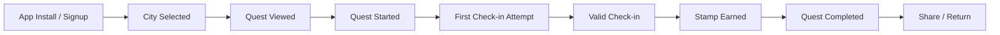

### 21.2 Events to track

```txt
user_signed_up
city_selected
home_viewed
quest_list_viewed
quest_detail_viewed
quest_started
place_detail_viewed
check_in_started
check_in_success
check_in_failed_distance
stamp_earned
quest_completed
passport_viewed
itinerary_requested
itinerary_generated
itinerary_failed
submission_created
share_card_clicked
```

### 21.3 MVP success metrics

Activation:

- % registered users selecting a city
- % users viewing at least one quest detail
- % users starting a quest

Engagement:

- quest detail views per active user
- check-in attempts per user
- stamps earned per user

Completion:

- % users earning first stamp
- % users completing first quest

Retention:

- D1 return
- D7 return
- users with 2+ sessions

Supply:

- number of curated places
- number of published quests
- number of submitted events/places
- submission approval rate

---

## 22. Gamification Model

### 22.1 XP rules

```txt
Valid place check-in: +50 XP
First stamp ever: +100 XP bonus
Complete quest: +200 XP
Complete all starter quests in a city: +500 XP
Approved submission: +100 XP
Share completion card: +20 XP, max once per quest
```

### 22.2 Stamp rarity

```txt
common      normal place check-in
rare        limited-time event or hidden gem
epic        quest completion reward
legendary   official partner campaign or city-level completion
```

### 22.3 Badge ideas

```txt
Museum Rookie       Earn 3 museum stamps
Heritage Hunter     Complete 1 heritage quest
Weekend Explorer    Complete quest on weekend
City Finisher       Complete all starter quests in a city
Early Explorer      Joined during beta
Culture Seeker      Earn stamps in 3 different categories
```

### 22.4 Abuse prevention

- XP awarded server-side only.
- Unique constraint prevents duplicate stamps.
- Share XP should be rate-limited.
- Check-in validation must not trust client-only status.
- QR tokens, when implemented, must be signed.

---

## 23. Data Ingestion Strategy

### 23.1 Phase 1 — Manual curation

Admin manually enters seed data.

Target seed for one city:

- 20 places
- 5 quests
- 20 stamps
- 5 events

### 23.2 Phase 2 — User/community submission

Users submit event/place suggestions. Admin reviews.

### 23.3 Phase 3 — AI-assisted extraction

Admin or user submits a source URL/text. AI extracts structured fields into `submissions.extracted_data`. Admin approves.

### 23.4 Phase 4 — Partner onboarding

Venues and communities get an organizer/admin flow.

### 23.5 Not allowed in MVP

Do not build large-scale scraping of social media comments, private profiles, or platform-restricted content.

Allowed MVP alternatives:

- manual link submission
- official website parsing when allowed
- partner-submitted event forms
- public RSS/news summaries if compliant
- admin-curated social trend notes without automated scraping

---

## 24. Security, Privacy, and Compliance

### 24.1 Location privacy

- Do not track background location.
- Ask permission only at point of need.
- Store check-in coordinates only for explicit check-in attempts.
- Provide deletion/export path in future.

### 24.2 User data

- Protect user profile and passport data with RLS.
- Public profiles are not required in MVP.
- Do not expose email addresses in public APIs.

### 24.3 Admin safety

- Admin role must be assigned manually.
- Admin routes must validate server-side role.
- Admin actions should be logged post-MVP.

### 24.4 AI data handling

- Do not send unnecessary personal data to AI provider.
- Send only itinerary preferences and database records required for generation.
- Do not send exact check-in history unless needed and user consent exists.

---

## 25. Error States

### 25.1 Mobile errors

| Scenario | UX |
|---|---|
| No internet | Show cached data if available; otherwise retry state |
| Location denied | Explain permission needed for check-in |
| Too far from place | Show distance and allowed radius |
| GPS unavailable | Allow retry and explain issue |
| Quest unpublished | Show not found / unavailable |
| AI fails | Show rule-based itinerary fallback |
| Empty city | Show “Coming soon” state |

### 25.2 Admin errors

| Scenario | UX |
|---|---|
| Missing required field | Inline validation |
| Invalid lat/lng | Prevent save |
| Upload failed | Retry upload |
| Unauthorized | Redirect to login / no access |
| Publish incomplete quest | Show checklist of missing data |

---

## 26. Testing Strategy

### 26.1 Unit tests

Required:

- Haversine distance
- check-in validity
- duplicate stamp prevention helper
- quest progress calculation
- itinerary schema validation
- budget/duration formatter

### 26.2 Integration tests

Required:

- check-in edge function success
- check-in edge function too far
- generate-itinerary mock provider
- submission creation and admin approval

### 26.3 E2E smoke tests

Required flows:

1. User signs up.
2. User selects city.
3. User opens quest.
4. User performs mock valid check-in.
5. User sees stamp in passport.
6. Admin creates quest and publishes it.

---

## 27. Implementation Milestones

### Milestone 0 — Project scaffold

Deliverables:

- Monorepo
- Expo app runnable
- Next.js admin runnable
- Shared packages
- Supabase config
- README
- env examples

Acceptance:

- `pnpm install` works
- `pnpm dev` or documented commands run apps
- TypeScript compiles

### Milestone 1 — Database and seed data

Deliverables:

- Supabase migrations
- RLS baseline
- Seed city, places, quests, stamps
- Shared DB types

Acceptance:

- DB can be reset and seeded
- Published quests query works
- Admin user can be configured

### Milestone 2 — Mobile browse flow

Deliverables:

- Auth
- City selector
- Home
- Quest list
- Quest detail
- Place detail

Acceptance:

- User can browse seeded city and quest
- Quest detail displays ordered stops

### Milestone 3 — Check-in and passport

Deliverables:

- Location permission
- Check-in edge function
- Stamp awarding
- XP update
- Passport screen

Acceptance:

- Valid check-in awards stamp
- Invalid check-in does not award stamp
- Passport shows earned stamp

### Milestone 4 — Admin CMS

Deliverables:

- Admin login
- Dashboard
- Places CRUD
- Events CRUD
- Quests CRUD
- Quest builder
- Stamps CRUD

Acceptance:

- Admin can create and publish a quest
- Mobile app shows published quest

### Milestone 5 — AI itinerary

Deliverables:

- AI provider abstraction
- Mock provider
- Generate-itinerary edge function
- Itinerary generator screen
- Itinerary result screen

Acceptance:

- User can generate and save itinerary
- Output only references database places
- Fallback works without AI key

### Milestone 6 — Submissions

Deliverables:

- Mobile submit screen
- Submissions table
- Admin review page
- Optional parse-submission function

Acceptance:

- User can submit event/place
- Admin can approve/reject
- Approved item can be converted to draft

### Milestone 7 — Polish and beta

Deliverables:

- Share card
- Better empty/loading/error states
- Analytics events
- QA pass
- Beta deployment

Acceptance:

- App is demo-ready with one city
- Internal beta users can complete a quest

---

## 28. Acceptance Checklist for MVP Launch

Product:

- [ ] One city has at least 20 places.
- [ ] One city has at least 5 quests.
- [ ] Every quest has at least 3 stops.
- [ ] Every check-in eligible place has coordinates.
- [ ] Every stamp has image or placeholder.
- [ ] AI itinerary has mock fallback.

Mobile:

- [ ] User can sign up.
- [ ] User can pick city.
- [ ] User can view quests.
- [ ] User can view quest detail.
- [ ] User can check in.
- [ ] User can earn stamp.
- [ ] User can view passport.
- [ ] User can generate itinerary.

Admin:

- [ ] Admin can login.
- [ ] Admin can CRUD places.
- [ ] Admin can CRUD quests.
- [ ] Admin can manage quest stops.
- [ ] Admin can review submissions.
- [ ] Admin can publish/unpublish.

Infra:

- [ ] Supabase migrations run cleanly.
- [ ] RLS policies enabled.
- [ ] Edge functions deploy.
- [ ] Admin app deploys.
- [ ] Mobile app builds.
- [ ] Env vars documented.

Quality:

- [ ] Typecheck passes.
- [ ] Lint passes.
- [ ] Critical tests pass.
- [ ] No AI key exposed to client.
- [ ] No admin-only data visible to public users.

---

## 29. Environment Variables

### 29.1 Root `.env.example`

```env
# Supabase
SUPABASE_URL=
SUPABASE_ANON_KEY=
SUPABASE_SERVICE_ROLE_KEY=

# Mobile public env
EXPO_PUBLIC_SUPABASE_URL=
EXPO_PUBLIC_SUPABASE_ANON_KEY=
EXPO_PUBLIC_MAP_PROVIDER=
EXPO_PUBLIC_MAPBOX_TOKEN=
EXPO_PUBLIC_GOOGLE_MAPS_KEY=

# Admin
NEXT_PUBLIC_SUPABASE_URL=
NEXT_PUBLIC_SUPABASE_ANON_KEY=

# AI server-side only
AI_PROVIDER=mock
OPENAI_API_KEY=
ANTHROPIC_API_KEY=

# Analytics
POSTHOG_KEY=
POSTHOG_HOST=

# App config
CHECK_IN_RADIUS_METERS=200
APP_ENV=local
```

Security note:

- `SUPABASE_SERVICE_ROLE_KEY`, `OPENAI_API_KEY`, and `ANTHROPIC_API_KEY` must never be exposed in mobile or browser client bundles.

---

## 30. Suggested Kimchi / Codex / Claude Build Prompts

### 30.1 Scaffold prompt

```txt
/ferment Build the Questara monorepo from docs/PRD.md.

Stack:
- Expo React Native with TypeScript in apps/mobile
- Next.js with TypeScript in apps/admin
- Supabase migrations and edge functions in supabase/
- Shared packages for types, utils, UI, and AI provider abstraction

First milestone only:
- create runnable scaffold
- configure pnpm workspace or turbo monorepo
- add lint/typecheck scripts
- add README and env examples
- do not implement full app yet
```

### 30.2 Database prompt

```txt
/ferment Implement the database layer from the PRD.

Create Supabase migrations for:
profiles, cities, places, events, quests, quest_stops, stamps, check_ins, user_stamps, itineraries, submissions.

Add indexes, basic RLS, admin helper function, and seed data for one Indonesian city with sample places, quests, and stamps.
Also generate shared TypeScript types in packages/types.
```

### 30.3 Mobile browse prompt

```txt
/ferment Implement the mobile MVP browse flow.

Use Expo Router and Supabase.
Screens:
Login, Register, CitySelector, Home, QuestList, QuestDetail, PlaceDetail, Passport.

Requirements:
- use seeded Supabase data if env exists
- use mock data fallback if env missing
- show published quests only
- show ordered quest stops
- polish loading, empty, and error states
```

### 30.4 Check-in prompt

```txt
/ferment Implement GPS check-in and stamp awarding.

Create supabase/functions/check-in.
Add mobile check-in flow.
Rules:
- location permission requested only when checking in
- backend validates distance using Haversine
- valid check-in creates check_ins row
- valid check-in upserts user_stamps row
- duplicate stamp should not duplicate XP
- invalid check-in should not award stamp
- return progress and stamp data
Add tests for distance and reward logic.
```

### 30.5 Admin CMS prompt

```txt
/ferment Implement admin dashboard.

Use Next.js and Supabase.
Pages:
Dashboard, Cities, Places, Events, Quests, QuestBuilder, Stamps, Submissions, CheckIns, Users.

Requirements:
- admin role required
- CRUD forms with validation
- quest builder can add/reorder stops
- publish/unpublish quests
- review submissions
```

### 30.6 AI itinerary prompt

```txt
/ferment Implement AI itinerary generation.

Create packages/ai with provider abstraction and mock provider.
Create supabase/functions/generate-itinerary.
Create mobile ItineraryGenerator and ItineraryResult screens.

Rules:
- AI must only use database places/events passed in context
- output must be strict JSON matching schema
- validate place IDs before saving
- fallback to heuristic itinerary if AI fails
- save result to itineraries table
```

---

## 31. Open Questions

1. Which city should be the MVP launch city?
2. Should MVP require login before browsing, or allow guest browsing?
3. Which map provider should be used first?
4. Should check-in radius be fixed globally or configurable per place?
5. Do stamps need custom artwork in MVP or can placeholders be used?
6. Should event submission be available to all users or only approved organizers?
7. Should itinerary generation be gated behind login?
8. What is the first acquisition channel: TikTok content, museum partnership, campus ambassadors, or communities?

Recommended default answers for MVP:

1. Pick one city with dense cultural places.
2. Allow guest browsing, require login for check-in/stamps.
3. Use Mapbox or Google Maps depending on budget/access.
4. Use global 200m radius first.
5. Use placeholders first, custom art later.
6. Allow all users to submit, admin reviews.
7. Require login to save itinerary, allow demo generation if needed.
8. Start with community/content-led beta.

---

## 32. Future Roadmap

### 32.1 Post-MVP features

- QR partner check-in
- Venue/organizer dashboard
- Sponsored quests
- City campaign pages
- Leaderboards
- Friend groups
- Shared itinerary planning
- In-app ticketing affiliate
- Public creator profiles
- More advanced route optimization
- Push notifications
- Seasonal quests
- Official museum/city passport partnerships

### 32.2 Potential monetization

B2B/B2G:

- paid city campaigns
- official digital passport programs
- venue analytics
- sponsored quests

B2C:

- premium curated itineraries
- limited stamp packs
- paid guided quests

Affiliate:

- ticketing
- tours
- cafes/restaurants
- transport partners
- accommodation later

---

## 33. MVP Demo Script

1. Open Questara.
2. Login as demo user.
3. Select Surabaya.
4. View Home and Featured Quests.
5. Open “Surabaya Heritage Starter”.
6. View roadmap and stops.
7. Open first place detail.
8. Use demo/mock location to check in.
9. Earn stamp.
10. Open Passport.
11. Generate a 6-hour itinerary from the quest.
12. Open Admin Dashboard.
13. Show quest builder and submissions review.
14. Publish a new quest.
15. Return to mobile and show new quest available.

---

## 34. Definition of Done

A feature is done when:

1. It meets the PRD acceptance criteria.
2. It has loading, empty, and error states.
3. It is typed end-to-end.
4. It does not expose server secrets.
5. It respects RLS and admin permissions.
6. It has basic test coverage for critical logic.
7. It works with seeded data.
8. It works in mock mode where applicable.
9. It is documented enough for another agent/developer to continue.

---

## 35. Final Product Direction

Questara should start as a gamified cultural discovery app, not a generic AI travel planner. The first product win is making users want to complete local routes and collect stamps. AI should improve planning and content operations, but the emotional hook is the passport, quest, and completion loop.

Build order:

1. Curated city data
2. Quest roadmap
3. GPS check-in
4. Stamp passport
5. Admin CMS
6. AI itinerary
7. Submissions
8. Partner/organizer features

The MVP is successful if a user can open the app, find a quest, visit a place, check in, earn a stamp, and feel motivated to continue exploring.
