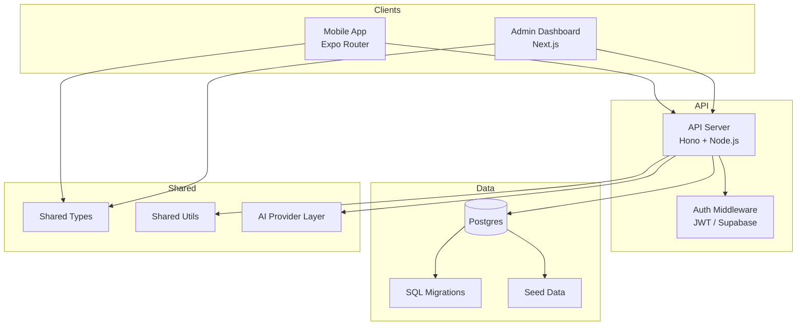
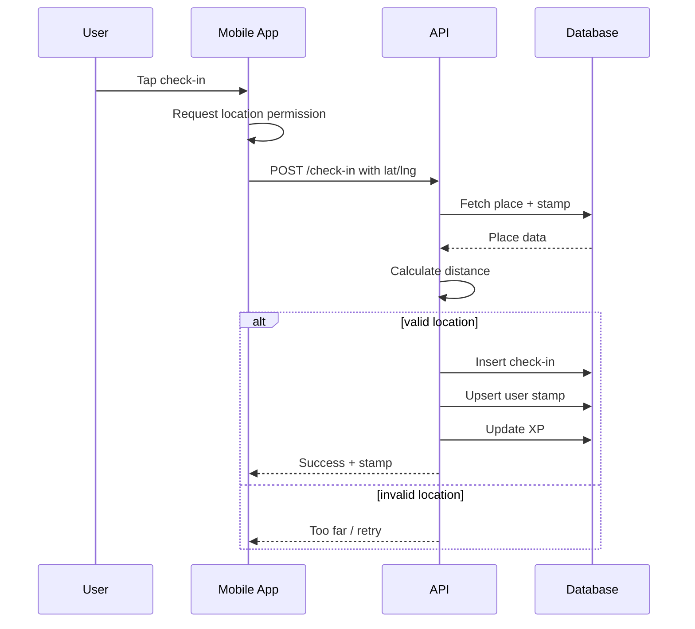
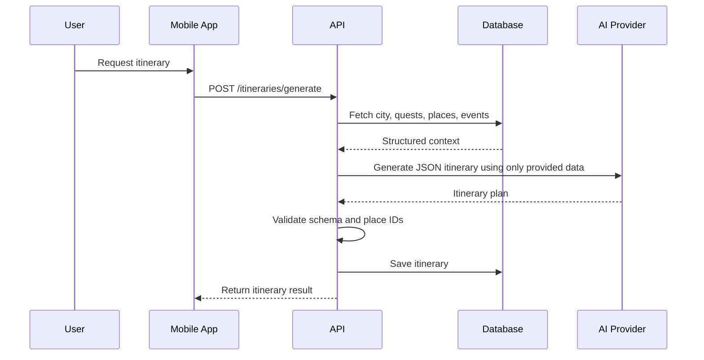

# Questara

Questara is a gamified local discovery platform for Indonesian cities.
It combines curated quests, map-based exploration, GPS check-ins, digital stamps, and AI-assisted itinerary generation.

## Repository Overview

This repo is a monorepo for the core Questara stack:

- `apps/api` - Hono-based REST API server
- `apps/admin` - Next.js admin dashboard for content operations
- `apps/mobile` - Expo Router mobile app
- `packages/types` - shared TypeScript domain types
- `packages/utils` - shared utilities such as distance and validation helpers
- `packages/ui` - shared UI primitives
- `packages/ai` - AI provider abstraction and prompt/schema contracts
- `migrations` - SQL migrations for Postgres
- `seed.sql` - sample data for the first launch city

## What Questara Does

Questara helps users:

- discover curated places and events by city
- follow quest routes with ordered stops
- check in at real locations using GPS
- collect collectible stamps in a passport
- generate itineraries from database-backed content only
- submit places or events for admin review

## System Architecture



## Core Flows

### Check-In Flow



### Itinerary Generation



## Local Development

### Requirements

- Node.js 20+
- pnpm 9+
- Postgres 16+

### Install

```bash
pnpm install
```

### Run Everything

```bash
pnpm dev
```

### Run Individual Apps

API:

```bash
pnpm --filter @questara/api dev
```

Admin:

```bash
pnpm --filter @questara/admin dev
```

Mobile:

```bash
pnpm --filter mobile start
```

### Run Tests

```bash
pnpm test
```

### Typecheck

```bash
pnpm typecheck
```

## Environment Variables

Copy [`.env.production.example`](./.env.production.example) for production deployments.
For local development, populate the values needed by the API, admin app, and mobile app.

Important values:

- `DATABASE_URL`
- `SUPABASE_URL`
- `SUPABASE_ANON_KEY`
- `SUPABASE_SERVICE_ROLE_KEY`
- `AI_PROVIDER`
- `CHECK_IN_RADIUS_METERS`

## Deployment

Production deployment is defined in:

- [docker-compose.prod.yml](./docker-compose.prod.yml)
- [apps/api/Dockerfile](./apps/api/Dockerfile)
- [apps/admin/Dockerfile](./apps/admin/Dockerfile)
- [scripts/migrate.sh](./scripts/migrate.sh)

### Production Stack

- API container on port `3001`
- Admin container on port `3000`
- Postgres container on port `5432`

### Production Setup

1. Set production environment variables.
2. Provision Postgres or use the bundled `db` service in compose.
3. Run SQL migrations.
4. Start the stack with Docker Compose.
5. Deploy mobile separately with Expo EAS.

### Example

```bash
docker compose -f docker-compose.prod.yml up -d --build
```

## Infrastructure Notes

- API is server-side authoritative for check-ins, XP, and stamp awards.
- AI must only use database-backed places and events.
- Admin actions should be protected by role-based access control.
- Public mobile data should come from published quests, verified places, and approved events.

## Documentation

- [PRD docs](./docs/PRD/README.md)
- [Implementation playbook](./docs/PRD/06-implementation-playbook.md)
- [Task board](./docs/PRD/09-task-board.md)

## Status

See [docs/PRD/08-status.md](./docs/PRD/08-status.md) for the current implementation progress summary.
