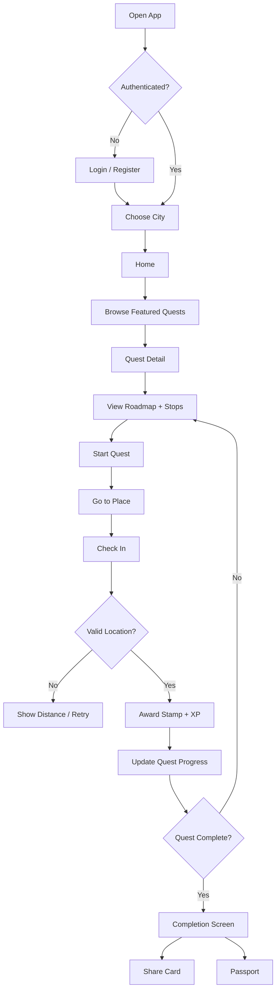
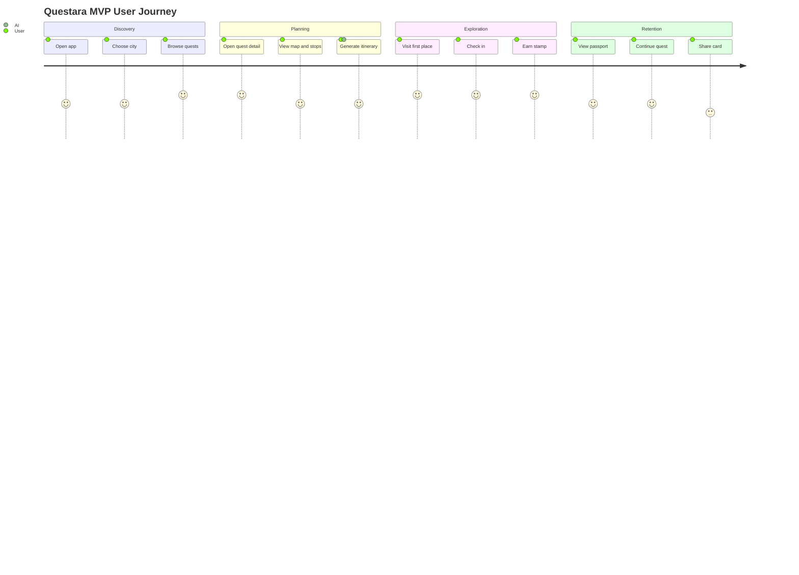
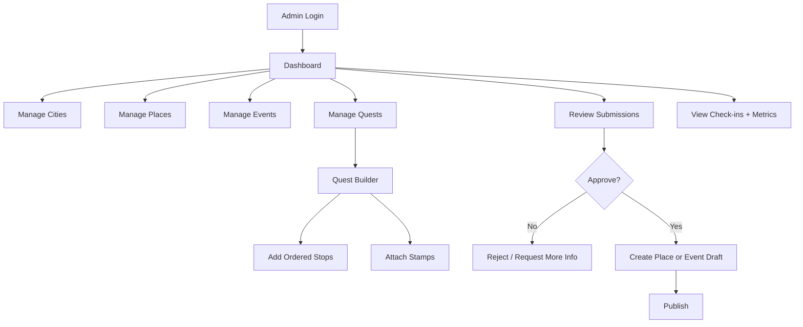
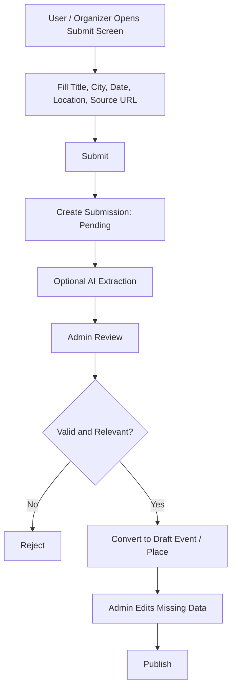
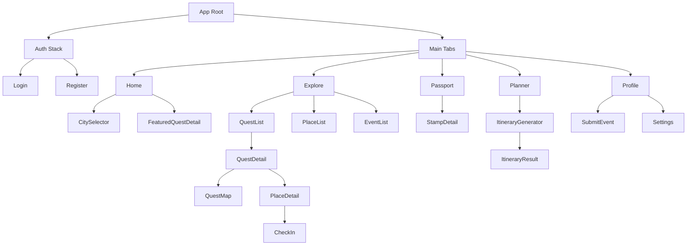
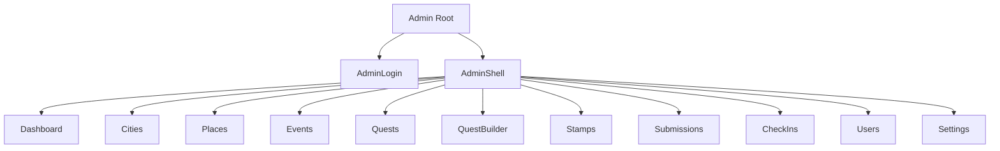

# PRD v0.2 — Questara

**Product:** Questara / JelajahPass / StampTrip  
**Category:** Gamified local discovery, cultural tourism, event bundling, and AI-assisted trip planning  
**Target market:** Indonesia  
**Initial MVP city:** Pick one: Surabaya, Jakarta, Yogyakarta, Bandung, or Malang  
**Primary niche for MVP:** Museum, heritage, art, culture, walking routes, and curated weekend experiences  
**Document audience:** Founder, product, design, engineering, AI coding agents  
**Agent targets:** Kimchi, Codex, Claude Code, Cursor, Windsurf, Copilot, Devin-like agents  
**Status:** Draft for implementation  
**Version:** 0.2  
**Last updated:** 2026-06-14  

---

## 6. Target Users and Personas

### 6.1 Persona A — Urban Explorer

**Profile:** 18–35, lives in a big Indonesian city, likes cafes, museums, art, hidden gems, and weekend activities.

**Needs:**

- Easy answer to “weekend ini ke mana?”
- Curated routes instead of raw search results
- A fun reason to visit cultural places
- Shareable achievements
- Low-budget exploration

**Pain points:**

- Too many scattered recommendations
- Events disappear in social feeds
- Plans are hard to coordinate
- Boring directories do not motivate action

### 6.2 Persona B — Domestic Cultural Tourist

**Profile:** Tourist visiting a city for 1–3 days.

**Needs:**

- Fast planning
- Places near each other
- Realistic itinerary
- Budget and duration estimate
- Local cultural context

### 6.3 Persona C — Museum / Venue Admin

**Profile:** Museum/gallery/venue representative.

**Needs:**

- Increase visits
- Promote events
- Run campaigns
- Track engagement
- Participate in city-wide quests

### 6.4 Persona D — Local Community Organizer

**Profile:** Walking tour, art collective, heritage community, student community, culture creator.

**Needs:**

- Promote events
- Submit activities
- Reach interested audiences
- Bundle event with nearby locations

---
## 7. Core Product Concepts

### 7.1 City

A geographic market, e.g. Surabaya, Jakarta, Bandung, Yogyakarta.

### 7.2 Place

A real-world destination: museum, gallery, heritage site, cafe, park, public space.

### 7.3 Event

A time-bound activity at a place or city area.

### 7.4 Quest

A curated bundle/roadmap of places and optionally events.

Example:

- “Surabaya Heritage Starter”
- “Jakarta Museum Weekend”
- “Jogja Art Walk”
- “Bandung Date Quest”

### 7.5 Quest Stop

One ordered stop in a quest. Usually linked to a place.

### 7.6 Check-in

A user action that proves or approximates that the user visited a place.

MVP methods:

- GPS radius validation
- QR validation for partner locations, optional after MVP

### 7.7 Stamp

A collectible digital item awarded for visiting a place or completing a quest.

### 7.8 Passport

The user’s collection of stamps and city progress.

### 7.9 Itinerary

A generated plan that orders places/events into a schedule based on user preferences, budget, start point, and available time.

---
## 8. MVP Scope

### 8.1 Mobile app MVP

Required screens:

1. Login
2. Register
3. City Selector
4. Home
5. Quest List
6. Quest Detail
7. Quest Map
8. Place Detail
9. Check-in
10. Passport
11. Stamp Detail
12. Itinerary Generator
13. Itinerary Result
14. Event/Place Submission
15. Profile

### 8.2 Admin MVP

Required screens:

1. Admin Login
2. Dashboard
3. Cities CRUD
4. Places CRUD
5. Events CRUD
6. Quests CRUD
7. Quest Builder
8. Stamps CRUD
9. Submissions Review
10. Check-ins Overview
11. Users Overview

### 8.3 Backend MVP

Required backend capabilities:

1. Supabase Auth
2. Database migrations
3. Row Level Security
4. Seed data
5. Storage buckets
6. Edge function: check-in
7. Edge function: generate-itinerary
8. Edge function: parse-submission-link or parse-event-text
9. Shared TypeScript types
10. Basic analytics/event logging

---
## 9. User Experience Overview

### 9.1 Core mobile flow

### 9.2 User journey map

### 9.3 Admin flow

### 9.4 Community submission flow

---
## 10. Information Architecture

### 10.1 Mobile navigation

### 10.2 Admin navigation

---
