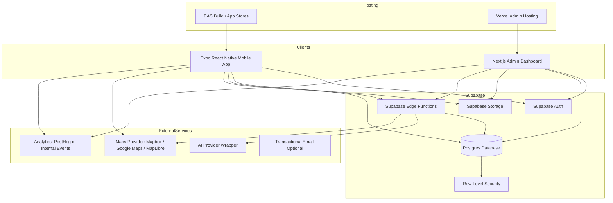
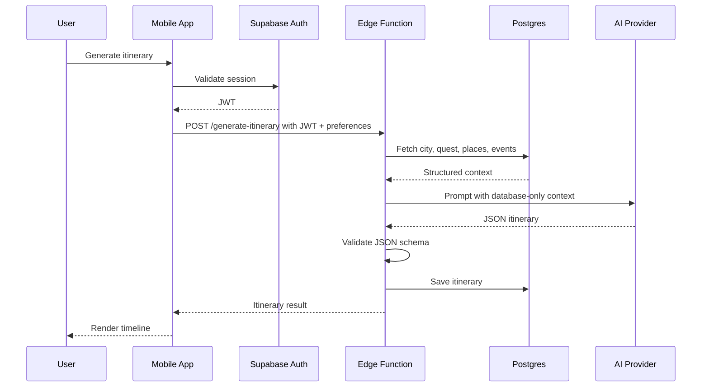
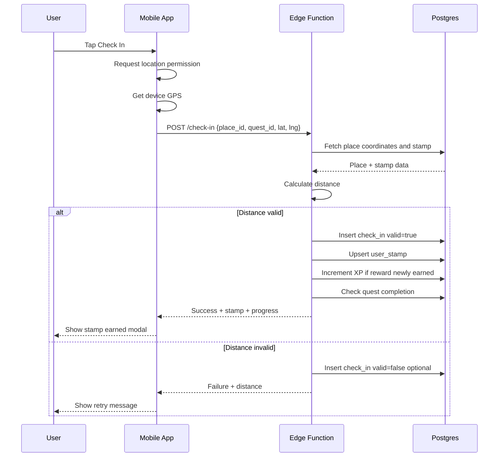
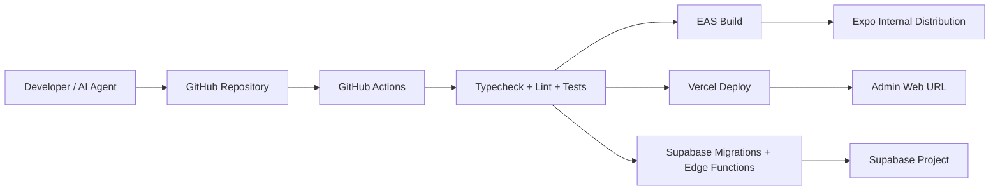
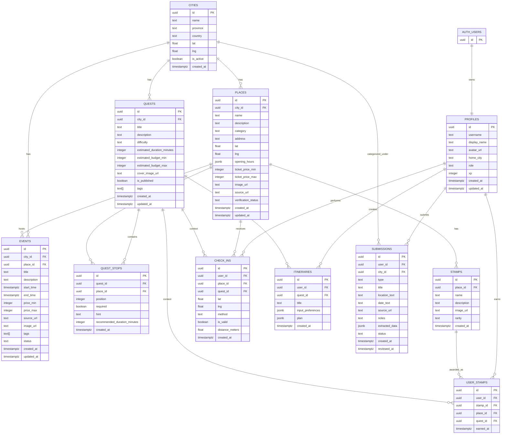

# PRD v0.2 — Questara

**Product:** Questara / JelajahPass / StampTrip  
**Category:** Gamified local discovery, cultural tourism, event bundling, and AI-assisted trip planning  
**Target market:** Indonesia  
**Initial MVP city:** Pick one: Surabaya, Jakarta, Yogyakarta, Bandung, or Malang  
**Primary niche for MVP:** Museum, heritage, art, culture, walking routes, and curated weekend experiences  
**Document audience:** Founder, product, design, engineering, AI coding agents  
**Agent targets:** Kimchi, Codex, Claude Code, Cursor, Windsurf, Copilot, Devin-like agents  
**Status:** Draft for implementation  
**Version:** 0.2  
**Last updated:** 2026-06-14  

---


## 13. Infrastructure Architecture

### 13.1 High-level architecture



### 13.2 Request lifecycle



### 13.3 Check-in lifecycle



### 13.4 Deployment architecture



### 13.5 Recommended environments

```txt
local     Local development using mock data and local Supabase if desired
staging   Shared test environment with seeded data
prod      Production environment
```

### 13.6 Infrastructure components

| Component | Recommendation | Notes |
|---|---|---|
| Mobile app | Expo React Native | Fast iteration, iOS/Android |
| Admin app | Next.js | Easy deploy to Vercel |
| Auth | Supabase Auth | Email/password initially |
| Database | Supabase Postgres | Structured places, quests, stamps |
| Storage | Supabase Storage | Place images, stamp images, avatars |
| Backend functions | Supabase Edge Functions | Check-in, AI itinerary, parser |
| Maps | Mapbox or Google Maps | Use provider abstraction |
| AI | Provider-agnostic wrapper | Keep mock provider |
| Analytics | PostHog or internal table | Track funnel events |
| CI/CD | GitHub Actions | Typecheck, lint, tests |
| Admin hosting | Vercel | Simple Next.js hosting |
| Mobile build | EAS | Expo app builds |

---
## 14. Repository Structure

```txt
questara/
  apps/
    mobile/
      app/
      components/
      features/
      lib/
      assets/
      package.json
    admin/
      app/
      components/
      features/
      lib/
      package.json
  packages/
    types/
      src/
        database.ts
        domain.ts
        api.ts
    utils/
      src/
        distance.ts
        dates.ts
        currency.ts
        validation.ts
    ui/
      src/
        Button.tsx
        Card.tsx
        Badge.tsx
    ai/
      src/
        prompts.ts
        schema.ts
        provider.ts
        mockProvider.ts
  supabase/
    migrations/
    seed.sql
    functions/
      check-in/
        index.ts
      generate-itinerary/
        index.ts
      parse-submission/
        index.ts
  docs/
    README.md
    PRD/
      README.md
      00-foundation.md
      01-concepts-and-scope.md
      02-functional-requirements.md
      03-architecture-data-api.md
      04-ui-admin-ops.md
      05-testing-roadmap.md
  .github/
    workflows/
      ci.yml
  package.json
  pnpm-workspace.yaml
  turbo.json
  README.md
  .env.example
```

---
## 15. Database Model

### 15.1 Entity relationship diagram



### 15.2 SQL schema draft

```sql
create extension if not exists "pgcrypto";

create table public.profiles (
  id uuid primary key references auth.users(id) on delete cascade,
  username text unique,
  display_name text,
  avatar_url text,
  home_city text,
  role text not null default 'user' check (role in ('user', 'admin')),
  xp integer not null default 0,
  created_at timestamptz not null default now(),
  updated_at timestamptz not null default now()
);

create table public.cities (
  id uuid primary key default gen_random_uuid(),
  name text not null,
  province text,
  country text not null default 'Indonesia',
  lat double precision,
  lng double precision,
  is_active boolean not null default true,
  created_at timestamptz not null default now()
);

create table public.places (
  id uuid primary key default gen_random_uuid(),
  city_id uuid not null references public.cities(id) on delete cascade,
  name text not null,
  description text,
  category text not null,
  address text,
  lat double precision not null,
  lng double precision not null,
  opening_hours jsonb,
  ticket_price_min integer,
  ticket_price_max integer,
  image_url text,
  source_url text,
  verification_status text not null default 'draft' check (verification_status in ('draft', 'verified', 'rejected')),
  created_at timestamptz not null default now(),
  updated_at timestamptz not null default now()
);

create table public.events (
  id uuid primary key default gen_random_uuid(),
  city_id uuid not null references public.cities(id) on delete cascade,
  place_id uuid references public.places(id) on delete set null,
  title text not null,
  description text,
  start_time timestamptz,
  end_time timestamptz,
  price_min integer,
  price_max integer,
  source_url text,
  image_url text,
  tags text[] not null default '{}',
  status text not null default 'draft' check (status in ('draft', 'published', 'expired', 'rejected')),
  created_at timestamptz not null default now(),
  updated_at timestamptz not null default now()
);

create table public.quests (
  id uuid primary key default gen_random_uuid(),
  city_id uuid not null references public.cities(id) on delete cascade,
  title text not null,
  description text,
  difficulty text not null default 'easy' check (difficulty in ('easy', 'medium', 'hard')),
  estimated_duration_minutes integer,
  estimated_budget_min integer,
  estimated_budget_max integer,
  cover_image_url text,
  is_published boolean not null default false,
  tags text[] not null default '{}',
  created_at timestamptz not null default now(),
  updated_at timestamptz not null default now()
);

create table public.quest_stops (
  id uuid primary key default gen_random_uuid(),
  quest_id uuid not null references public.quests(id) on delete cascade,
  place_id uuid not null references public.places(id) on delete cascade,
  position integer not null,
  required boolean not null default true,
  hint text,
  recommended_duration_minutes integer,
  created_at timestamptz not null default now(),
  unique (quest_id, position),
  unique (quest_id, place_id)
);

create table public.stamps (
  id uuid primary key default gen_random_uuid(),
  place_id uuid not null references public.places(id) on delete cascade,
  name text not null,
  description text,
  image_url text,
  rarity text not null default 'common' check (rarity in ('common', 'rare', 'epic', 'legendary')),
  created_at timestamptz not null default now()
);

create table public.check_ins (
  id uuid primary key default gen_random_uuid(),
  user_id uuid not null references public.profiles(id) on delete cascade,
  place_id uuid not null references public.places(id) on delete cascade,
  quest_id uuid references public.quests(id) on delete set null,
  lat double precision,
  lng double precision,
  method text not null default 'gps' check (method in ('gps', 'qr', 'manual_admin')),
  is_valid boolean not null default false,
  distance_meters double precision,
  created_at timestamptz not null default now()
);

create table public.user_stamps (
  id uuid primary key default gen_random_uuid(),
  user_id uuid not null references public.profiles(id) on delete cascade,
  stamp_id uuid not null references public.stamps(id) on delete cascade,
  place_id uuid not null references public.places(id) on delete cascade,
  quest_id uuid references public.quests(id) on delete set null,
  earned_at timestamptz not null default now(),
  unique (user_id, stamp_id, quest_id)
);

create table public.itineraries (
  id uuid primary key default gen_random_uuid(),
  user_id uuid not null references public.profiles(id) on delete cascade,
  quest_id uuid references public.quests(id) on delete set null,
  title text,
  input_preferences jsonb not null default '{}',
  plan jsonb not null default '{}',
  created_at timestamptz not null default now()
);

create table public.submissions (
  id uuid primary key default gen_random_uuid(),
  user_id uuid references public.profiles(id) on delete set null,
  city_id uuid references public.cities(id) on delete set null,
  type text not null default 'event' check (type in ('event', 'place')),
  title text not null,
  location_text text,
  date_text text,
  source_url text,
  notes text,
  extracted_data jsonb not null default '{}',
  status text not null default 'pending' check (status in ('pending', 'approved', 'rejected', 'converted')),
  created_at timestamptz not null default now(),
  reviewed_at timestamptz
);
```

### 15.3 Indexes

```sql
create index idx_places_city_id on public.places(city_id);
create index idx_places_category on public.places(category);
create index idx_events_city_id on public.events(city_id);
create index idx_events_status on public.events(status);
create index idx_events_start_time on public.events(start_time);
create index idx_quests_city_id on public.quests(city_id);
create index idx_quests_is_published on public.quests(is_published);
create index idx_quest_stops_quest_id on public.quest_stops(quest_id);
create index idx_check_ins_user_id on public.check_ins(user_id);
create index idx_check_ins_place_id on public.check_ins(place_id);
create index idx_user_stamps_user_id on public.user_stamps(user_id);
create index idx_itineraries_user_id on public.itineraries(user_id);
create index idx_submissions_status on public.submissions(status);
```

### 15.4 RLS policy overview

MVP RLS rules:

| Table | Read | Insert | Update | Delete |
|---|---|---|---|---|
| profiles | own profile + public limited | own profile via trigger | own profile | admin only |
| cities | public active cities | admin | admin | admin |
| places | verified places public | admin | admin | admin |
| events | published events public | admin | admin | admin |
| quests | published quests public | admin | admin | admin |
| quest_stops | if parent quest published | admin | admin | admin |
| stamps | public if place verified | admin | admin | admin |
| check_ins | own only, admin all | edge function/admin | admin only | admin only |
| user_stamps | own only, admin all | edge function/admin | admin only | admin only |
| itineraries | own only, admin optional | own via edge function | own | own/admin |
| submissions | own + admin all | authenticated users | admin | admin |

Admin helper:

```sql
create or replace function public.is_admin()
returns boolean
language sql
security definer
as $$
  select exists (
    select 1 from public.profiles
    where id = auth.uid() and role = 'admin'
  );
$$;
```

---
## 16. API and Edge Function Contracts

### 16.1 `POST /check-in`

Purpose: Validate GPS/QR check-in and award stamp.

Request:

```json
{
  "place_id": "uuid",
  "quest_id": "uuid-or-null",
  "lat": -7.2458,
  "lng": 112.7378,
  "method": "gps"
}
```

Response success:

```json
{
  "ok": true,
  "valid": true,
  "distance_meters": 72.4,
  "allowed_radius_meters": 200,
  "stamp_awarded": true,
  "xp_awarded": 50,
  "quest_completed": false,
  "stamp": {
    "id": "uuid",
    "name": "Museum Explorer",
    "image_url": "https://...",
    "rarity": "common"
  },
  "progress": {
    "completed_stops": 2,
    "total_required_stops": 5
  }
}
```

Response invalid:

```json
{
  "ok": true,
  "valid": false,
  "distance_meters": 854.1,
  "allowed_radius_meters": 200,
  "message": "You are too far from this place to check in."
}
```

Server responsibilities:

1. Authenticate user.
2. Validate input schema.
3. Fetch place and stamp.
4. Calculate distance.
5. Insert check-in.
6. If valid, upsert user stamp.
7. Award XP only if new stamp was created.
8. Detect quest completion.
9. Award quest completion XP once.
10. Return progress.

### 16.2 `POST /generate-itinerary`

Purpose: Generate route/timeline from database-backed places/events.

Request:

```json
{
  "city_id": "uuid",
  "quest_id": "uuid-or-null",
  "start_location_text": "Stasiun Gubeng",
  "available_hours": 6,
  "budget_idr": 200000,
  "preferences": ["museum", "heritage", "cafe", "not too crowded"],
  "date": "2026-06-20"
}
```

Response:

```json
{
  "ok": true,
  "itinerary_id": "uuid",
  "plan": {
    "title": "6 Jam Jelajah Heritage Surabaya",
    "summary": "A compact cultural route with museum stops and nearby cafe break.",
    "total_estimated_budget_idr": 150000,
    "total_estimated_duration_minutes": 360,
    "stops": [
      {
        "order": 1,
        "time": "10:00",
        "place_id": "uuid",
        "place_name": "Museum 10 November",
        "activity": "Explore the museum and collect your first stamp.",
        "duration_minutes": 90,
        "estimated_budget_idr": 20000,
        "transport_note": "Start here because it is close to the requested starting area.",
        "check_in_available": true
      }
    ],
    "warnings": [
      "Opening hours for one cafe need confirmation."
    ]
  }
}
```

Server responsibilities:

1. Authenticate user.
2. Validate input.
3. Fetch city, quest stops, places, and relevant events.
4. Optionally geocode start location through map provider.
5. Build deterministic context.
6. Call AI provider with strict prompt and schema.
7. Validate JSON output.
8. Save itinerary.
9. Return result.

Fallback behavior:

If AI provider fails, return a heuristic itinerary:

- Use quest stop order if quest selected.
- Otherwise sort nearby places by distance and preference match.
- Add warning: “AI generation unavailable. Showing rule-based itinerary.”

### 16.3 `POST /parse-submission`

Purpose: Extract structured event/place data from user-submitted text/source.

Request:

```json
{
  "submission_id": "uuid"
}
```

Response:

```json
{
  "ok": true,
  "extracted_data": {
    "title": "Walking Tour Kota Lama",
    "date_text": "Sabtu, 20 Juni 2026",
    "location_text": "Kota Lama Surabaya",
    "price_text": "Gratis",
    "tags": ["heritage", "walking tour"],
    "confidence": 0.72,
    "missing_fields": ["exact_start_time"]
  }
}
```

Rules:

- Do not automatically publish.
- Mark confidence.
- Preserve source URL.
- Admin must review.

### 16.4 `GET /quest-progress`

This can be implemented as a view or client query.

Input:

```json
{
  "quest_id": "uuid"
}
```

Output:

```json
{
  "quest_id": "uuid",
  "completed_stops": 2,
  "total_required_stops": 5,
  "completed_place_ids": ["uuid", "uuid"],
  "is_completed": false
}
```

---
## 17. AI System Design

### 17.1 AI responsibilities

AI may be used for:

1. Itinerary narration
2. Stop ordering explanation
3. Event/place submission extraction
4. Quest title and description generation for admin tools
5. Summarizing source text

AI must not be used for:

1. Inventing places not in database
2. Inventing active events not in database or submission text
3. Final check-in validation
4. Payment or legal decisions
5. Publishing user submissions without review

### 17.2 Provider abstraction

Create interface:

```ts
export interface AIProvider {
  generateItinerary(input: GenerateItineraryInput): Promise<GenerateItineraryOutput>;
  parseSubmission(input: ParseSubmissionInput): Promise<ParseSubmissionOutput>;
}
```

Implementations:

```txt
MockAIProvider       deterministic local fake output
OpenAIProvider       optional
AnthropicProvider    optional
```

### 17.3 Itinerary prompt template

```txt
System:
You are an itinerary planner for Indonesian local tourism.
You must only use the provided database records.
Never invent places, events, prices, opening hours, or coordinates.
If information is missing, include it in warnings.
Return strict JSON only.

Context:
City: {{city}}
Date: {{date}}
User preferences: {{preferences}}
Available hours: {{available_hours}}
Budget IDR: {{budget_idr}}
Start location: {{start_location_text}}

Database places:
{{places_json}}

Database events:
{{events_json}}

Quest stops if selected:
{{quest_stops_json}}

Task:
Create a realistic itinerary.
Requirements:
- Use only place_id values from provided data.
- Include timeline.
- Include estimated duration.
- Include estimated budget.
- Include transport notes.
- Include check-in opportunities.
- Include warnings for missing or uncertain data.

JSON schema:
{{schema}}
```

### 17.4 Output schema

```ts
export type ItineraryPlan = {
  title: string;
  summary: string;
  total_estimated_budget_idr: number | null;
  total_estimated_duration_minutes: number | null;
  stops: Array<{
    order: number;
    time: string | null;
    place_id: string;
    place_name: string;
    activity: string;
    duration_minutes: number | null;
    estimated_budget_idr: number | null;
    transport_note: string | null;
    check_in_available: boolean;
  }>;
  warnings: string[];
};
```

### 17.5 AI safety/quality checks

Before saving itinerary:

- Validate JSON schema.
- Confirm every `place_id` exists in fetched context.
- Remove or reject invented place IDs.
- Ensure total duration does not exceed available hours by more than tolerance.
- Ensure budget warnings appear if budget exceeds user input.

---
## 18. Maps and Location

### 18.1 Required map features

MVP:

- Show single place marker
- Show quest stop markers
- Show approximate route order
- Open external maps for navigation

Post-MVP:

- In-app route polyline
- Multi-modal routing
- Transit/walking estimates
- Offline city packs

### 18.2 Location permissions

Mobile app should request location permission only when:

- user checks in
- user asks for nearby places
- user opens route/navigation requiring current location

Permission copy:

> Questara uses your location to verify check-ins and help you find nearby quest stops. We do not continuously track your location.

### 18.3 Distance utility

Use Haversine formula:

```ts
export function calculateDistanceMeters(
  a: { lat: number; lng: number },
  b: { lat: number; lng: number }
): number {
  const R = 6371000;
  const toRad = (value: number) => (value * Math.PI) / 180;
  const dLat = toRad(b.lat - a.lat);
  const dLng = toRad(b.lng - a.lng);
  const lat1 = toRad(a.lat);
  const lat2 = toRad(b.lat);

  const h =
    Math.sin(dLat / 2) ** 2 +
    Math.cos(lat1) * Math.cos(lat2) * Math.sin(dLng / 2) ** 2;

  return 2 * R * Math.asin(Math.sqrt(h));
}
```

---
