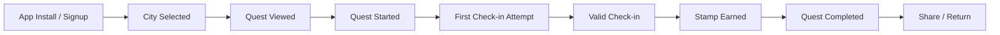

# PRD v0.2 — Questara

**Product:** Questara / JelajahPass / StampTrip  
**Category:** Gamified local discovery, cultural tourism, event bundling, and AI-assisted trip planning  
**Target market:** Indonesia  
**Initial MVP city:** Pick one: Surabaya, Jakarta, Yogyakarta, Bandung, or Malang  
**Primary niche for MVP:** Museum, heritage, art, culture, walking routes, and curated weekend experiences  
**Document audience:** Founder, product, design, engineering, AI coding agents  
**Agent targets:** Kimchi, Codex, Claude Code, Cursor, Windsurf, Copilot, Devin-like agents  
**Status:** Draft for implementation  
**Version:** 0.2  
**Last updated:** 2026-06-14  

---


## 19. Mobile UI Requirements

### 19.1 Visual style

Suggested style:

- modern, playful, travel-inspired
- warm cultural visual language
- card-based quest discovery
- stamp/passport collectible feel
- map-forward but not overloaded

### 19.2 Home screen

Sections:

1. Header: selected city and profile avatar
2. Continue Quest
3. Featured Quests
4. This Weekend
5. Nearby Stamps
6. Passport Progress

States:

- Loading skeleton
- Empty city state
- Empty quest state
- Offline/error state

### 19.3 Quest card

Required content:

- cover image
- title
- city
- number of stops
- estimated duration
- estimated budget
- difficulty
- reward preview
- CTA: Start / Continue

### 19.4 Quest detail

Required content:

- cover image
- title
- description
- tags
- duration/budget/difficulty
- progress bar
- map preview
- ordered stops
- reward preview
- CTA

### 19.5 Check-in screen/modal

Required states:

- permission request
- checking location
- success with stamp
- too far with distance
- already collected
- error/no GPS

### 19.6 Passport screen

Required content:

- XP/level summary
- city filter
- stamp grid
- locked stamp silhouettes
- quest completion cards

### 19.7 Itinerary screen

Generator fields:

- city
- quest optional
- starting location
- available hours
- budget
- preferences
- date

Result display:

- title
- summary
- total budget/duration
- timeline list
- warnings
- CTA to start quest if linked

---
## 20. Admin UI Requirements

### 20.1 Admin dashboard

Cards:

- Total users
- Total places
- Total quests
- Published events
- Check-ins this week
- Stamps earned
- Pending submissions

Charts optional post-MVP.

### 20.2 Places CRUD

Fields:

- name
- city
- category
- description
- address
- lat/lng
- opening hours JSON
- price min/max
- image
- source URL
- verification status

Validation:

- name required
- city required
- category required
- lat/lng required for check-in eligible places

### 20.3 Quest builder

Features:

- create quest
- add stops from places list
- reorder stops
- mark stop required/optional
- add hints
- publish/unpublish quest
- preview mobile card

### 20.4 Submissions review

Features:

- list pending submissions
- view raw user input
- view extracted AI fields
- approve/reject
- convert to place/event draft
- edit before publishing

---
## 21. Analytics and Metrics

### 21.1 Core funnel



### 21.2 Events to track

```txt
user_signed_up
city_selected
home_viewed
quest_list_viewed
quest_detail_viewed
quest_started
place_detail_viewed
check_in_started
check_in_success
check_in_failed_distance
stamp_earned
quest_completed
passport_viewed
itinerary_requested
itinerary_generated
itinerary_failed
submission_created
share_card_clicked
```

### 21.3 MVP success metrics

Activation:

- % registered users selecting a city
- % users viewing at least one quest detail
- % users starting a quest

Engagement:

- quest detail views per active user
- check-in attempts per user
- stamps earned per user

Completion:

- % users earning first stamp
- % users completing first quest

Retention:

- D1 return
- D7 return
- users with 2+ sessions

Supply:

- number of curated places
- number of published quests
- number of submitted events/places
- submission approval rate

---
## 22. Gamification Model

### 22.1 XP rules

```txt
Valid place check-in: +50 XP
First stamp ever: +100 XP bonus
Complete quest: +200 XP
Complete all starter quests in a city: +500 XP
Approved submission: +100 XP
Share completion card: +20 XP, max once per quest
```

### 22.2 Stamp rarity

```txt
common      normal place check-in
rare        limited-time event or hidden gem
epic        quest completion reward
legendary   official partner campaign or city-level completion
```

### 22.3 Badge ideas

```txt
Museum Rookie       Earn 3 museum stamps
Heritage Hunter     Complete 1 heritage quest
Weekend Explorer    Complete quest on weekend
City Finisher       Complete all starter quests in a city
Early Explorer      Joined during beta
Culture Seeker      Earn stamps in 3 different categories
```

### 22.4 Abuse prevention

- XP awarded server-side only.
- Unique constraint prevents duplicate stamps.
- Share XP should be rate-limited.
- Check-in validation must not trust client-only status.
- QR tokens, when implemented, must be signed.

---
## 23. Data Ingestion Strategy

### 23.1 Phase 1 — Manual curation

Admin manually enters seed data.

Target seed for one city:

- 20 places
- 5 quests
- 20 stamps
- 5 events

### 23.2 Phase 2 — User/community submission

Users submit event/place suggestions. Admin reviews.

### 23.3 Phase 3 — AI-assisted extraction

Admin or user submits a source URL/text. AI extracts structured fields into `submissions.extracted_data`. Admin approves.

### 23.4 Phase 4 — Partner onboarding

Venues and communities get an organizer/admin flow.

### 23.5 Not allowed in MVP

Do not build large-scale scraping of social media comments, private profiles, or platform-restricted content.

Allowed MVP alternatives:

- manual link submission
- official website parsing when allowed
- partner-submitted event forms
- public RSS/news summaries if compliant
- admin-curated social trend notes without automated scraping

---
## 24. Security, Privacy, and Compliance

### 24.1 Location privacy

- Do not track background location.
- Ask permission only at point of need.
- Store check-in coordinates only for explicit check-in attempts.
- Provide deletion/export path in future.

### 24.2 User data

- Protect user profile and passport data with RLS.
- Public profiles are not required in MVP.
- Do not expose email addresses in public APIs.

### 24.3 Admin safety

- Admin role must be assigned manually.
- Admin routes must validate server-side role.
- Admin actions should be logged post-MVP.

### 24.4 AI data handling

- Do not send unnecessary personal data to AI provider.
- Send only itinerary preferences and database records required for generation.
- Do not send exact check-in history unless needed and user consent exists.

---
